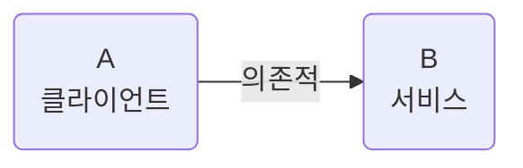
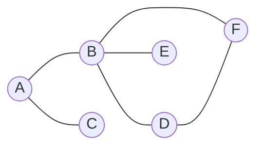
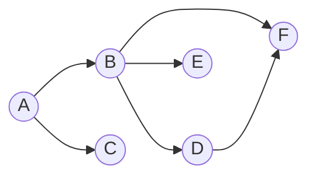
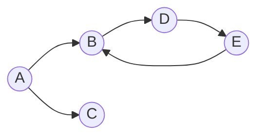
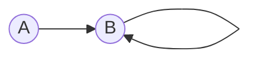

# Chapter 2. 의존성과 계층화

## 의존성의 정의
- A가 B에 의존적이다.

#### 퍼스트파티 의존성
- 솔루션 내의 타 프로젝트에 대한 의존성
- 프로젝트에서 참조 등록만 하거나, using 선언만 한 경우 실제 의존성이 발생하지 않는다.
- 코드를 직접 호출한 경우 의존성이 발생한다.
#### 프레임워크 의존성
- 닷넷 프레임워크에 대한 여러 가지 참조를 가지게 되는데, 실제 사용하지 않는 의존성들은 삭제해도 애플리케이션 동작에 무관하다.
- 불필요한 프레임워크 의존성을 제거하면 각 프로젝트가 필요로 하는 의존 관계를 시각화하기가 더 수월하다.
#### 서드파티 의존성
- 서드파티 의존성을 솔루션에 하나의 폴더(Dependencies)를 만들어 여기에 모든 .dll을 모아두어 관리를 편리하게 한다.
  - 모든 외부 의존성을 소스 제어 저장소에 보관할 수 있다.
  - 다른 개발자가 중앙 저장소에서 내려받을때 필요한 의존성들도 함께 내려받을 수 있다.
- NuGet 의존성 관리로 더 나은 관리가 가능하다.
### 유향 그래프를 이용한 의존성 모델링
- 그래프는 노드(node)와 엣지(edge)라는 두가지 요소로 구성된 수학적 구조체이다.
- 무향 그래프

- 다이 그래프

- 순환 의존성

- 재귀 호출

## 의존성 관리하기
- 의존성으로 인한 문제는 실제로 문제가 발생한 후에는 바로잡기가 어렵다.
- 시작 단계에서 의존성을 관리하고 지속적으로 관심을 두어 문제가 발생하지 않도록 하는 것이 최선이다.
- 안티 패턴을 피해야 한다.
### 구현과 인터페이스의 비교
### new 키워드의 코드 스멜
- 코드 스멜
  - 어떤 코드가 잠재적으로 문제가 있을 수 있음을 표현하는 단어
  - 동일한 코드 스멜이 두 군데서 발견된다고 해서 항상 똑같이 문제가 발생한다고 보기 어렵다.
  - 먼가 잘못될 가능성이 있다는 경고
- 구현 향상이 불가능
- 의존성 체인
- 테스트 가능성의 부재
- 보다 부적절한 결합
### 객체 생성에 대한 대안
- 인터페이스를 기초로 한 코딩
- 의존성 주입 기법 활용하기
### 추종자 안티패턴
- 뭔가 단순한 것을 요구했는데 관련된 모든 것들이 따라오는 상황에서 비롯된 이름
- 개발자들이 인터페이스에 기반한 프로그래밍을 설명할 때 흔히 저지르는 실수
- 인터페이스와 그에 관련된 의존성들은 동일한 어셈블리에 존재해서는 안된다.
~~~plantuml
@startuml
package Contoller{
    class AccountController{
        +ChangePassword()
    }
}
package Service{
    Interface ISecurityService<<Interface>>{
        +ChangeUserPassword()
    }
    Class SecurityService{
        +ChangeUserPassword()
    }
    ISecurityService<.right.AccountController
    ISecurityService<.up.SecurityService
}
~~~
~~~plantuml
@startuml
package Contoller{
    class AccountController{
        +ChangePassword()
    }
}
Package ServiceImpl{
    Class SecurityService{
        +ChangeUserPassword()
    }
}
package Service{
    Interface ISecurityService<<Interface>>{
        +ChangeUserPassword()
    }
    ISecurityService<.right.AccountController
    ISecurityService<.up.SecurityService
}
~~~
### 계단 패턴
~~~plantuml
@startuml
package Contoller{
    class AccountController{
        +ChangePassword()
    }
}
package Service{
    Interface ISecurityService<<Interface>>{
        +ChangeUserPassword()
    }
    Class SecurityService{
        +ChangeUserPassword()
    }
    ISecurityService<.down.AccountController
    ISecurityService<.up.SecurityService
}
package Domain{
    Interface IUserRepository<<Interface>>{
        +GetByID()
    }
    Class UserRepository{
        +GetByID()
    }
    IUserRepository<.down.SecurityService
    IUserRepository<.up.UserRepository
}
package NHibernate{
    Interface ISession<<Interface>>{
        +Get()
    }
    Class Session{
        +Get()
    }
    ISession<.up.Session
    ISession<.down.UserRepository
}
~~~
~~~plantuml
@startuml
package Contoller{
    class AccountController{
        +ChangePassword()
    }
}
Package ServiceImpl{
    Class SecurityService{
        +ChangeUserPassword()
    }
}
package Service{
    Interface ISecurityService<<Interface>>{
        +ChangeUserPassword()
    }
    ISecurityService<.right.AccountController
    ISecurityService<.up.SecurityService
}
Package DomainRepositorys{
    Class UserRepository{
        +GetByID()
    }
}
package Domain{
    Interface IUserRepository<<Interface>>{
        +GetByID()
    }
    IUserRepository<.right.SecurityService
    IUserRepository<.up.UserRepository
}
package NHibernate{
    Interface ISession<<Interface>>{
        +Get()
    }
    Class Session{
        +Get()
    }
    ISession<.up.Session
    ISession<.Right.UserRepository
}
~~~
### 의존성 해석하기
### NuGet을 이용한 의존성 관리

## 계층화
### 일반적인 패턴
### 횡단 관심사
### 비대칭 계층화

## 마치며