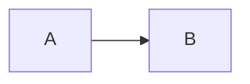
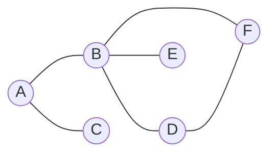
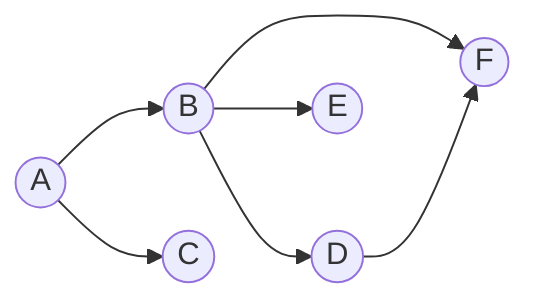

# Chapter 2. 의존성과 계층화

## 의존성의 정의
- 의존성(dependency)는 별개의 두 개체(entity) 사이의 연관 관계로 어느 한 개체가 다른 개체 없이 자신의 기능을 실행하지 못하는 관계를 나타낸다.
- A는 B에 의존적이다.

### Framework에 대한 의존성
- 퍼스트 파티 의존성
- CLR을 사용하는 것은 자연스러움
### 서드 파티에 대한 의존성
- nuget을 이용한 의존성을 관리
## 유향 그래프를 이용한 의존성 모델링
### 무향 그래프

### 유향 그래프

- 의존성은 상속(~~일반화Generalization 쓰지마~~, 실체화Realization), ~~집합(결합이 이상한 번역)(aggregation) UML2.0에서 거의 삭제~~, 합성~~조합이 이상한 번역~~(composition) ,연관(association) 으로 나타낼 수 있다. composition을 숭배해야 한다.
  - managed 언어에서는 composition과 association을 구별할 수 없다.
  - unmanaged 언어에서는 composition은 개체의 수명주기 일치와 관련이 있다.
  - 공통적으로 clone시 deepcopy 대상을 표시하기 위해 composition을 사용 할 수 있다.
### 순환 의존성
  - 비쥬얼 스튜디오에서 순환 의존적 어셈블리를 구성하지 못한다.
## 의존성 관리하기
### 구현과 인터페이스 비교
  - 런타임, 컴파일 타임
  - 인터페이스를 이용한 다형성은 런타임
  - 인터페이스만 사용하여 추상적으로 설계하자
### new 키워드의 코드 스멜
  - 인터페이스는 구체 방법을 명세하지 않는다.
  - 추상팩토리
~~~plantuml
@startuml
skinparam componentStyle uml2
class Client
class AbstractFactory <<interface>>
class AbstractProductA <<interface>>
class ProductA2
class ProductA1
class ConcreteFactory1
class ConcreteFactory2
class AbstractProductB <<interface>>
class ProductB1
class ProductB2
AbstractFactory <-- Client
Client --> AbstractProductA
Client --> AbstractProductB
AbstractFactory <|.. ConcreteFactory1
AbstractFactory <|.. ConcreteFactory2
AbstractProductA <|.. ProductA1
AbstractProductA <|.. ProductA2
AbstractProductB <|.. ProductB1
AbstractProductB <|.. ProductB2
ProductA1 <-- ConcreteFactory1
ProductB1 <-- ConcreteFactory1
ProductA2 <-- ConcreteFactory2
ProductB2 <-- ConcreteFactory2
@enduml
~~~
   - 인터페이스를 특정 구현체로 형 변환(다운캐스팅)하면 무조건 잘못. LSP 위반. 쓰지마시오. 
   - DI
### 객체 생성에 대한 대안
   - DI
### 추종자 안티패턴
   - 인터페이스와 구체클래스를 다른 어셈블리로 분할하자
   - 구체클래스는 public으로 하지 말자. 
   - 팩토리를 통해 외부 어셈블리에서는 인터페이스만 사용 가능하게 할 수 있다.
### 계단 패턴
   - 대체 얼마나 많은 어셈블리를 관리해야 하는거야? 모든 인터페이스와 클래스를 하나의 어셈블리에 나누어 구현하면 솔루션에 프로젝트가 200개 쯤 되야겠군!!
   - 그렇게 하는게 옳다.
   - 디커플링이 매우 심해져서 F11키는 의미 없어짐. 하지만 ctrl+shift+F가 있다. codelens기능을 잘 쓰면 좋다.
### 의존성 해석하기
   - 필요할 때 사용

### Nuget을 이용한 의존성 관리
   - 반드시 사용할것
   - 솔루션 개발시 계층화 설계가 잘 된다면 nuget 패키지화도 가능하다.
   - Chocolatey는 비추. 리눅스용이 없음

## 계층화
   - 참조 아키텍쳐
   - Layered 아키텍쳐 (DDD)
   - CBD(Component Based Development)
### 일반적인 패턴
   - 먼저 가장 간단한 방법을 먼저 적용
   - 그다음 리팩토링
   - 리팩토링을 하기 위해서는 반드시 테스트 코드가 필요하다.
      - 기능은 바뀌지 않고 설계가 바뀐다.
   - 인터페이스로 설계되어야 함
### 횡단 관심사
   - AOP
### 비대칭 관심사
   - CQS
   - CQRS
## 마치며
   - 의존성 관리는 장기적으로 건실하고, 적응성이 뛰어나며, 변화를 수용할 수 있도록 프로젝트를 유지할 수 있는 유일한 방법이다.
   - 프로젝트가 진행 될수록 기능 하나를 추가하는 비용은 기하 급수적으로 증가 하게 된다. 의존성을 관리하지 않는다면...