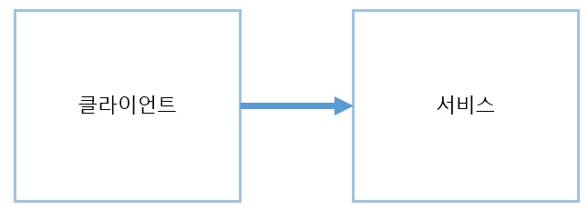

## 의존성과 계층화

- 모든 소프트웨어는 의존성을 가지고 있고 왠만한 프로젝트는 다음 세가지 의존성을 찾아 볼 수 있다.
  - 같은 기반 코드를 이용하는 코드에 대한 퍼스트 파티 의존성
  - 외부 어셈블리에 대한 서드 파티 의존성
  - 마이크로 닷넷 프레임워크에 대한 보편적인 의존성

- 의존성은 호출자 코드로 부터 기능을 추상화한다.
- 변화를 수용할 수 있는 코드를 작성하기 위해서는 의존성을 효과적으로 관리해야 한다.

### 의존성의 정의

- 의존성은 별개의 두 엔티티 사이의 연관 관계로 인해 어느 한 엔티티가 다른 엔티티의 기능 없이는 자신의 기능을 실행하지 못하는 관계를 의미한다.

- 클라이언트는 서비스에 의존적이며, 서비스는 의존적이지 않다.

- 호출자 : 클라이언트, 피호출자 : 서비스

- 참조를 걸 경우 참조가 걸린 대상에 대해 의존적이게 됨(어셈블리가 로드된다.)

- 같은 비주얼 스튜디오 내에 종속된 애플리케이션들은 퍼스트파티 의존성을 가지고있다.

- 직접 해결책을 개발하기에 큰 노력이 드는 솔루션 대신 미리 만들어진 라이브러리를 사용하는 것은 서드파티 의존성을 가지게 된다.

- **유향 그래프를 이용한 의존성 모델링**

  - 그래프는 노드와 엣지라는 두가지 요소로 구성된 수학적 구조체이다.

  - 모든 노드는 그래프 내에서 여러 개의 노드와 연결 될 수 있다.

  

  - 종속적인 코드에서 의존성을 제공하는 코드의 방향성을 나타내면 의존성 다이그래프가 된다.

  - 화살표가 시작되는 노드는 종속적인 컴포넌트이고, 가리키는 노드는 의존성을 제공하는 컴포넌트이다.

  - **순환 의존성**

    - 자신이 참조하는 모든 어셈블리의 의존성에 대해 묵시적으로 의존성을 가진다.

    

    - 그로 인해 다음 그림과 같이 0이 3-1-2-4의 묵시적 의존성과 자기자신에게 묵시적 의존성을 가지게 되는 순환 의존성을 갖게되는데 이 상황은 일어나지 않아야 하는 일이다.
    - 루프는 순환 의존성 중 특이한 경우로 메서드 수준에서 재귀를 할 때 쓰인다.

### 의존성 관리하기

- 의존성을 잘 못 관리하면 개발 말미에 문제가 생길 가능성이 있으므로 세심한 관리가 필요하다.
- 구현체를 사용하면 클라이언트와의 의존성이 너무 높아지기에 인터페이스를 사용하는 것이 권장된다.
- **new 키워드의 코드 스멜**
  - new 키워드를 사용하면 생기는 문제점들은
    - 생성하는 클래스가 구현체에 강한 의존성이 생긴다.
    - 구현체가 가지고 있는 모든 의존성들을 묵시적으로 의존하게 된다.
    - 단위 테스트 용 객체를 생성 하기 어렵다.
- **객체 생성에 대한 대안**
  - 인터페이스를 기초로 한 코딩
    - 클라이언트 코드와 구현체가 인터페이스를 참조한다면 인터페이스만 의존하게 할 수 있다.
    - 하지만 인터페이스를 생성할 때 구현체의 인스턴스를 생성해야 하므로 추가적인 조치가 필요하다.
  - 의존성 주입 기법 활용하기
    - 인터페이스에 구현체의 인스턴스를 직접 생성해 참조하는 것 대신 외부에서 의존성을 주입시키는 방법으로 구현체의 의존성을 완전히 제거할 수 있다.
- **추종자 안티패턴**
  - 추종자 안티패턴은 인터페이스와 동일한 어셈블리에 구현체가 존재하여 인터페이스를 참조했을 때 원치 않은 의존성이 같이 따라오는 것을 의미한다.
  - 추종자 안티패턴을 회피하기 위해 인터페이스와 구현체를 따로 분리해야한다.
  - 안티패턴이 발생한다면 2가지의 문제점이 발생할 수 있다.
    - 프로그래머의 교육시 같은 어셈블리 내에 public으로 구현체를 구현했다가 구현체를 직접 참조하는 경우가 생긴다.
    - 새로운 기능을 추가하기 위해 구현체를 늘린다면 기반 코드에 또 다른 의존성을 추가하게 되어 덩치가 커지고 깨지기 쉬워진다.
- **계단패턴**
  - 클래스와 인터페이스를 관리하는 올바른 방법으로 인터페이스와 실제 구현 클래스를 다른 어셈블리에 정의하는 것이다.
  - 어셈블리의 갯수가 많이 늘어나지만 그만큼 잘 정리되고 이해하기 쉬운 솔루션을 갖게 된다.
  - 서드파티는 보통 인터페이스와 구현체를 한 어셈블리에 묶여있어 계단 패턴으로 만들기 어려우나 서드파티 전용 인터페이스를 만들어 퍼스트파티의 의존성으로 숨길 수 있다.
- **의존성 해석하기**
  - 어셈블리, 퓨전로그, 각종 서비스 등이 있다.
- **Nuget을 이용한 의존성 관리**
  - 서드파티를 관리하는 방법으로 간단하게 패키지를 사용 할 수 있다.

### 계층화

- 어셈블리끼리 구성하는 방법으로 관련된 어셈블리를 컴포넌트로 묶을 수 있다.
- 컴포넌트를 각 기능의 수평적 계급으로 취급하고 이를 바탕으로 애플리케이션을 구성하는 방법이다.
- 컴포넌트는 다른 컴포넌트의 상위에 위치할 수 있으며 의존성의 방향은 항상 아래를 향한다.
- 최하위 계층은 어떠한 의존성도 갖지않으며 최상위 계층은 사용자 인터페이스이다.
- **일반적인 패턴**
  - 솔루션의 복잡도에 따라 계층의 개수를 바꿔 계층화 할 수 있다.
  - 두 개의 계층
    - 두 계층은 사용자 인터페이스와 데이터베이스 계층으로 구분한다.
    - 사용자 인터페이스 계층이 데이터베이스 계층에 의존성을 갖고 있으며 빠르다.
    - 사용자 인터페이스 계층은 사용자에게 정보를 표시하고 요청을 받으며 애플리케이션을 사용하는 방법을 제공한다.
    - 데이터 베이스 계층의 데이터 액세스 인터페이스를 참조해야 계단패턴으로 의존성 회피가 가능하다.
    - 데이터 액세스 계층은 데이터에 대한 질의를 제공하며 최대한 가려져야 한다.
  - 세 개의 계층
    - 세 계층은 사용자 인터페이스와 데이터 액세스 계층 사이에 비즈니스 로직을 추가한 것이다.
    - 비즈니스 로직은 사용자 인터페이스의 명령을 처리하고 비즈니스 프로세스, 규칙 등을 정의한다.
- **횡단 관심사**
  - 컴포넌트의 계층을 하나의 계층으로 제한하기 쉽지 않은 감사, 보안, 캐시같은 것을 캡슐화된 기능으로 떼어 내어 코드에 적용하는 방법이다.
  - AOP 프레임워크가 횡단 관심사를 여러 계층에 적용하는 방법 중 하나이다.
- **비대칭 계층화**
  - 3계층 이상의 패턴에서 모든 사용자 요청이 꼭 로직을 거쳐 데이터를 액세스 할 필요가 없을 때 직접 부르는 패턴이다.
  - 명령과 질의를 분리하여 명령은 로직을 통과하고 질의는 직접 데이터를 액세스한다.
  - 명령은 값을 리턴받지 않으며 질의는 값을 리턴받는다.