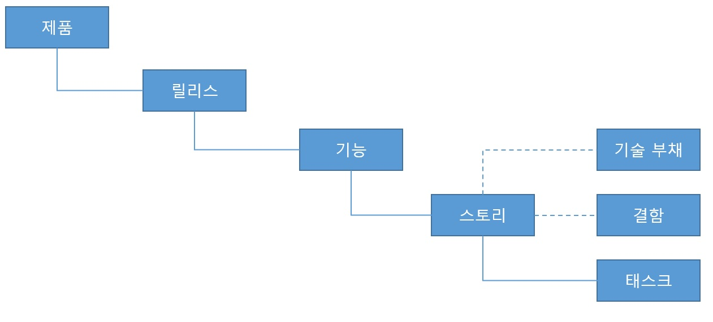
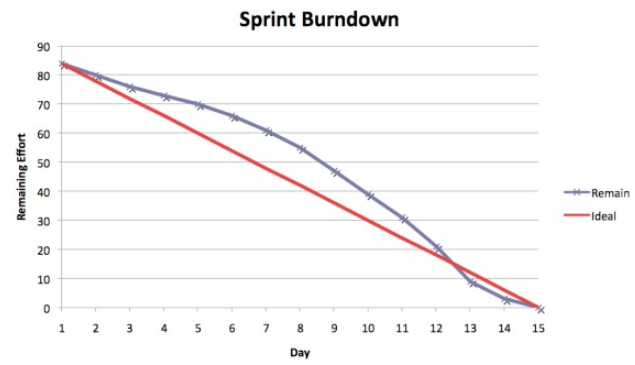
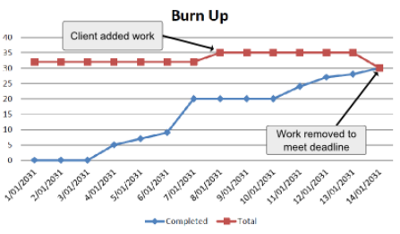

# 산출물

모든 애자일 프로세스와 다른 프로세서들의 가장 큰 차이점은 문서의 상대적 중요도이다. 애자일 프로세스에서는 반드시 필요한 것을 제외하고는 문서의 양을 줄이는 것을 목표로 하고 있다. 대신 애자일에서는 `코드`로 문서를 대신한다.

애자일 프로젝트에서도 문서는 중요한 부분을 차지하지만, 실제로 동작하는 소프트웨어나 구성원 같의 의사소통보다 더 중요하게 여기지는 않는다.

## 스크럼 보드

스크럼 프로젝트의 일상을 관리하는 중심은 스크럼 보드(Scrum board)이다. `물리적인 스크럼 보드는 반드시 필요하다.` 비록 디지털 스크럼 도구들도 유용하게 활용할 수는 있지만, 필자는 이런 도구들은 물리적 스크럼 보드를 보조하는 용도로 사용하는 것이 좋다고 생각한다.

### 카드

스크럼 보드에서 가장 중요한 아이템은 카드(card)이다. 이 카드는 아주 작은 태스크로부터 물리적인 소프트웨어의 릴리스에 이르기까지 소프트웨어 제품의 진도를 나타내는 개별적인 요소를 표현한다.

### 구성의 계층 구조

위 그림은 스크럼 보드 상의 카드들 사이의 상관 관계를 보여 준다. 주목할 점은 이 그림은 제품 자체가 여러 태스크의 조합으로 구성된다는 사실을 암시한다는 점이다. 아무리 복잡한 소프트웨어라 하더라도 결국에는 유한한 수의 개별 태스크로 나눌 수 있으며, 이들을 하나씩 완료함으로서 완성으로 가는 길을 닦아 나갈 수 있다.

### 제품

스크럼 먹이 사슬의 최상위에는 구현해야 할 소프트웨어 제품(product)이 존재한다.

`팀은 주로 한 번에 한 제품을 대상으로 작업을 수행하지만, 때로는 여러 개의 제품을 준비해야 할 때도 있다.`

### 릴리스

릴리스는 최종 사용자가 구매하거나 서비스로서 사용하게 되는 소프트웨어의 버전을 말한다.

핵심 고객에게 가치 있는 기능을 추가하기 위한 것이거나 또는 준비 중인 소프트웨어를 미리 살펴볼 수 있도록 베타 버전을 출시하는 경우도 릴리스라고 볼 수 있다.

스크럼은 매 스프린트가 끝날 때마다 문제없이 동작하는 소프트웨어를 출시할 수 있도록 하는 것에 집중함으로써 이런 릴리스 패턴을 이끌어 낼 수 있다.

### 기능

각 릴리스는 그전까지는 제공되지 않았던 하나 혹은 그 이상의 기능(feature)들로 구성된다.
`최소 시장성 기능(MMF, Minimum Marketable Feature)`이라는 단어는 기능을 묘사하고 릴리스를 구성하는 데 도움이 된다.

기능은 각 릴리스마다 필수(raquired), 선호(preferred), 바람(desired) 등 크게 세 가지로 분류될 수 있다. 이들은 각 기능에 배정되는 전체적인 우선순위를 반영하는 상호배타적인 옵션이다. 주로 개발팀은 선호되는 기능을 구현하기에 앞서 필수적으로 요구되는 기능을 먼저 구현하며, 바람에 해당하는 기능들은 시간적 여유가 있을 때만 구현한다.

분류는 언제든지 변경이 가능하다. 기능의 구현 요청이 취소되거나, 우선순위가 재조정되거나, 요구 사항이 변경되거나, 혹은 다른 기능으로 대체되는 상황은 언제든지 발생할 수 있으며, 팀은 이러한 변화에 유연하게 대응해야 한다.

### 사용자 스토리

사용자 스토리는 스크럼의 산출물 중 가장 많은 사람에게 익숙한 개념이겠지만, 아이러니하게도 이는 스크럼에서 정의한 개념이 아니다.

사용자 스토리는 아래의 템플릿을 이용해 정의한다.

`"[사용자의 역할]로서, 나는 [동사 위주의 행위]를 함으로써 [사용자에게 제공할 가치]를 얻고자 한다."`

대괄호는 사용자 스토리를 구분하기 위한 일종의 매개변수를 표시하기 위한 것이다. 실제 사례는 아래와 같다.

`"등록은 완료했지만 아직 인증을 받지 않은 사용자로서, 나는 비밀번호 재설정을 통해 비밀번호를 잃어버린 상황에서도 시스템에 로그인할 수 있어야 한다."`

사용자 스토리에서 주목할 만한 점이 여러 가지가 있다.

`실제로 어떤 기능을 구현해야하는지에 대한 출분한 상세 설명은 제공하지는 않는다는 점` 사용자 스토리는 사용자의 관점에서 작성되어야 한다.

사용자 스토리는 개발팀과 고객 사이의 대화를 표현한다. 이 스토리를 구현할 시기가 되면 이 스토리를 담당하게 된 개발자들은 이 스토리를 사용자에게 제시하고 그들의 요구 사항을 토대로 대화를 하게 된다. 이 분석 기간을 통해 사용자 스토리에 대해 반드시 충족되어야 할 여러 조건들을 도출하고 구현함으로써 비로서 사용자 스토리를 완료된 것으로 처리할 수 있다.

사용자 스토리는 개발자가 소프트웨어 제품과 관련이 있다고 확신을 하기 전까지는 스크럼 보드에서 개발 준비 단계로 이동하는 일이 없기 때문에 불필요한 노력을 방지하는 데 큰 도움이 된다.

### 태스크

사용자 스토리보다 더 작은 작업 단위가 바로 태스크(task)이다.

스토리는 여러 개의 관리 가능한 태스크로 분리되어 스토리에 배정된 개발자들에게 할당된다.

스토리가 완료되기까지 너무 오랜 기간이 소요되어 오랫동안 진행 중인 상태로 남아 있게 되면, 이는 애당초 너무 큰 작업이었으므로 더 작고 관리 가능한 스토리로 분리되었어야 한다는 것을 의미한다.

### 기술 부채

기술 부채란, 스토리가 스크럼 보드를 통해 진행되는 동안 만들어지는 디자인과 아키텍처의 타협을 의미하는 단어이다.

### 결함

결함을 표현하는 카드는 이미 완료된 사용자 스토리가 수렴 가능한 조건을 만족하지 못할 때마다 생성한다. 이 카드는 자동화된 태스트 환경을 필요로 한다.

기술 부채와 마찬가지로, 결함 카드는 스토리 포인트를 가지지 않기 때문에 결함과 기술 부채 카드를 생성하려면 인센티브를 줄여야 한다. 결함과 기술 부채를 완전히 없애는 것은 사실상 불가능하지만, 개발자들은 어떻게 해서라도 인센티브가 줄어드는 일은 피하고 싶을 것이다.

결함은 크게 A, B 혹은 C 등 세가지로 분류할 수 있다. A는 심각한 결함을 의미하며, B는 행위 오류, C는 표현 이슈를 뜻한다.

### 스웜레인

스크럼 보드에는 스윔레인(swimlane)을 구분하기 위해 수직으로 선이 그어져 있다. 각각의 스윔레인은 개발 주기에 걸쳐 진행 중인 스토리의 상태를 표시하기 위해 여러 개의 사용자 스토리 카드를 올려놓을 수 있다. 카드는 왼쪽에서 오른쪽 방향으로 이동하며, 기본적인 스윔레인은 백로그(Backlog), 진행 중(In Progress), QA 및 완료(Done)로 구성 된다.

백로그 레인(lane)의 소토리는 특정 스프린트에 진행하는 것으로 `승인된` 것이어야 하며, 스토리 보드에서 떼어내고 작업을 시작해야 한다. 이 레인에 올려진 카드들은 우선순위에 따라 정렬하여 가장 위의 아이쳄을 항상 먼저 구현해야 한다.

### 수평 스윔레인

스크럼 보드는 수평 스윔레인(horizontal swimlane)을 통해 구분될 수도 있다. 이 스윔레인을 통해 스토리를 기능 단위로 그룹화하여 모든 사람이 어느 지점에 팀의 역략이 집중되고 있는지, 그리고 나아가 어느 지점에 해소해야 할 병목 현상이 발생하는지를 한눈에 파악할 수 있도록 할 수 있다.

스크럼 보드의 가장 위쪽에는 서둘러야 할 일(Fast-Track) 레인이라는 특별한 레인이 존재하는데, 이 레인에는 매우 높은 우선순위를 갖는 태스크들이 나열된다. 이 레인의 아이템에 대해서는 다른 중요한 업무에 대해 약간의 손실을 감수하더라도 다같이 협력하여 최대한 빨리 마무리할 수 있도록 교육되어 있어야한다.

## 기술부채

사용자 스토리를 구현하는 과정에서는 언제든지 `이상적인 코드`와 `마감일을 맞추기에는 충분한 수준의 코드`사이의 타협이 발생하게 마련이다. 마감일을 맞추기 위해 형편없는 디자인을 의도적으로 허용해야 한다고 말하는 것은 아니지만, 향후의 개선점을 염두에 두고 지금 당장은 간단하게 해결하는 방법 역시 가치 있는 방법이다.

### 좋은 기술 부채와 나쁜 기술 부채

부채는 프로젝트 기간에 서서히 생겨난다. 이 겸을 우리는 어떻게 바라봐야 하는지를 잘 암시하는 단어는 바로 `부채(debt)`라는 단어이다.

지금 당장 차선책을 구현하여 일정을 맞추거나 추가 근무 시간을 투입하여 디자인을 향상시킬 수 있지만, 아마도 이 경우에는 마감일을 지키지 못할 것이다. 모든 상황에 적합한 정답은 없다. 그러나 좋은 기술 부채와 나쁜 기술 부채를 구분할 수 있는 가이드라인은 존재한다.

### 기술 부채의 사분면

우선 x, y 두개의 축을 이용하여 평면을 사분할하는데, 이 두 축에는 각각 `이 기술 부채가 합당한 이유를 통해 성성된 것인가?`와 `이 기술 부채를 회피할 대안을 알고 있는가?`라는 두 가지 질문이 연결되어 있다.

* `무분별함, 의도적` : 이런 종류의 부채는 가장 위험한 것이다. 이런 부채가 있다는 것은 `우리는 디자인에 투자할 시간 따위는 없다`고 말하는 것과 같으며, 근무 환경이 매우 열악하다는 것을 의마한다.

* `무분별함, 부주의함` : 이런 종류의 부채는 경험의 부족으로 인해 생겨난 것이 대부분이다. 즉, 근대 소프트웨어 엔지니어링에 대한 사례에 대해 제대로 알지 못한 결과일 뿐이다. 이런 경우에는 `교육이 답`이다.

* `분별 있음, 부주의함` : 이 경우는 기존의 사례를 충실히 따랐지만 그보다 더 나은 방법이 존재한다는 사실이 밝혀져 `이제는 이 작업을 어떻게 처리해야 하는지 알게 된` 경우이다. 이 경우에는 의사결정 당시 모든 개발자가 현재 채택한 방식이 이 문제를 해결하기 위한 최선이라고 동의했다는 점이 다르다.

* `분별 있음, 의도적` : 가장 무난한 형태의 부채라고 할 수 있다. 가능한 선택 사항에 대해 모두 고민한 후에 이 부채를 짊어질 것을 결정하기 때문에 정확히 어떤 일을 하려는 것인지 충분히 인지하고 있는 경우이다. 이런 부채는 주로 `우선 출시 후 처리하는`형태로 최종 의사결정이 내려진 경우에 발생한다.

### 부채 상환하기

기술 부채는 스토리 포인트와는 무관하지만, 직접적인 인센티브가 없다 하더라도 반드시 상환해야 한다. 가장 좋은 방법은 기술 부채 카드를 스토리에 부착하고 코드를 리팩토링하여 새로운 동작과 관련해 새로운 디자인을 구현하는 것이다.

### 디지털 스크럼 보드

디지털 스크럼 보드는 벽에 계속해서 매달아 두지 않으면 프로젝트에 대한 매우 중요한 정보를 보여주지 못한다. 진척 현황을 투명하게 공개하면, 특히 회사에 스크럼을 최초로 도입할 때 큰 이점을 얻게 된다. 업무가 잘 진행되고 있음을 공개함으로써 이해 관계자들로부터 신뢰를 얻을 수 있다.

지금까지 설명한 모든 도구 중에서도 가장 좋은것은 `지속적인 접촉(high-touch)`을 통해 `저항이 누그러든(low-resistance)`것들이다.

### 완료에 대한 정의

모든 프로젝트에는 `완료에 대한 정의(DoD, Definition of Done)`가 필요하다.

`완료`에 대한 정의를 모두가 동의하고 이를 완수하기 위해 분발해야 한다. 사용자 스토리가 조건에 부합하지 않는다면 완료 상태가 될 수 없다.

사용자 스토리가 완료되기 위해서는 반드시 다음의 사항을 준수해야 한다.

* 코드 실행의 성공 및 실패의 경우를 모두 커버할 수 있는 단위 테스트를 작성하며, 모든 테스트는 실패 없이 통과해야 한다.

* 모든 코드는 지속적 통합 서버에 전달되어 빌드 및 컴파일되어야 하며, 모든 테스트를 통과해야 한다.

* 제품 소유자와 함께 수렴 가능한 조건들에 대한 제품의 동작을 검증한다.

* 해당 스토리에 참여하지 않은 개발자와 짝을 이루어 코드를 리뷰한다.

* 의사소통에 필요한 만큼만 문서를 작성한다.

* 무분별한 기술 부채를 해결한다.

## 차트와 측정

스크럼 프로젝트는 다양한 종류의 차트를 이용해 진척도를 모니터링한다. 스크럼 차트를 통해 스크럼 프로젝트의 현재 상태와 진행 과정의 궤적을 활인할 수 있으며, 달성 가능한 향후의 성과를 예측할 수 있다.

이 차트는 팀의 역량을 공개적으로 측정하고 있음을 보여주기 위한 것이 아닐 뿐더러, 관리자들을 위해 프로젝트의 진척도를 측정하고 있다는 것을 보여 주기 위한 것도 아니다. 이는 진척도의 측정 방법을 모두에게 공개하는 것이며, 역량을 평가하기 위한 것이 아니라 전체 프로젝트의 문제점을 분석하기 위한 것임을 명확히 해야 한다.

관련 노트에는 개발자별로 달성한 스토리 포인트 등과 같은 개인적인 평가는 절대 언급되어서는 안된다. 이런 평가는 팀에 좋지 않은 메시지를 전달할 뿐이며, 개발자들은 팀 전체의 진척도보다는 개인의 진척도를 우선시하게 될 것이다.

### 스토리 포인트

스토리 포인트는 매 스프린트에 비즈니스 가치를 부여하여 팀을 독려하기 위한 장치이다. 스토리 포인트는 전체 팀이 스프린트 계획 회의를 진행하는 동안 사용자 스토리에 할당한다. 스토리 포인트는 사용자 스토리가 표현하는 특정 기능을 구현하는 데 필요한 상대적인 노력의 정도를 의미한다.

### 속도

스프린트를 연속해서 진행하다 보면 스토리 포인트를 달성하기 위해 평균적으로 소요되는 시간을 계산할 수 있게 된다. 팀이 세 개의 스프린트를 진행하는 동안 각각 8점, 12점 11점이 할당된 스토리를 완료했다고 가정해보자. 이 때 총 스트로 포인트는 31점이며, 평균 스토리 포인트는 10점이다. 이것을 팀의 속도(velocity)라고 하며, 두 가지 방법으로 활용할 수 있다.

먼저, 팀의 속도는 다음 스프린트에 팀이 커밋해야 할 포인트의 한계치이다. 만일 팀이 스프린트당 평균 10포인트를 획득한다면, 한 번의 작업 주기 내에 그보다 많은 양의 커밋을 발생시키는 것은 단순히 낙관적인 목표라고만 할 수 없다. 이로 인해 팀 저넻의 사기를 떨어뜨리는 실패를 경함하게 될 수 도 있다. 만일 팀이 10포인트의 목표를 설정하였는데 실제로 11포인트를 달성했다면, 팀의 속도는 (12 + 11 + 11) / 3 으로 계산하여 11로 변경된다. 이것이 바로 스크럼의 반복적인 피드백의 결과이다.

속도를 이용하는 두 번째 방법은 소프트웨어의 출시에 대한 문제를 분석하는 것이다. 한 스프린트가 지난 이후 팀의 속도가 눈에 띄게 감소했다면 이는 아마도 그 스프린트 기간에 뭔가 좋지 않은 일이 발생했기 때문일 것이며, 이에 대한 조정이 필요할 것이다.

이유가 무엇이든 팀의 속도가 25%하락한다고 해서 항상 뭔가 안 좋은 일이 발생하는 것은 아니지만, 조만간 최대한 빨리 해결해야 하는 문제가 생길 것이라는 암시이기도 하다. 속도가 주 단위로 줄어드는 현상은 분명히 문제점이며, 아마도 코드가 변화를 수용하지 못하고 있음을 의미하는 것이다.

### 스프린트 번다운 차트

매 스프린트를 시작할 때마다 2차원의 데카르트 그래프를 만들고 이를 스크럼 보드에 붙여 둔다. 이 그래프의 y축에는 총 스토리 포인트를 표시하며, x축에는 총 업무일수를 표시한다. 그런 후 아래 그림과 같이 이상적인 진척도를 의미하는 직성을 대각선으로 그린다.

매일 아침 스탠드 업 미팅을 진행할 때, 완료된 사용자 스토리로부터 관련된 포인트들을 획득하여 이 값을 현재 남은 포인트에서 뺀다. 아래 그림과 같이 이를 통해 스프린트 목표를 달성하기 위해 필요한 진행 상황 대비 실제 진행 상황을 파악할 수 있게 된다.

### 기능 번업 차트

스프린트 번다운 차트가 스프린트 기간에 스토리 포인트를 추적하기 위한 것이라면, 기능 번업 차트(feature burnup chart)는 기능들의 완료도를 표시한다. 각 스프린트를 완료할 때마다 새로운 기능의 구현이 완료될 수 있다. 이 그래프의 가장 큰 장점은 이 그래프에 표시되지 않은 채 기능이 완료된 것 처럼 눈속임을 할 수 없다는 점이다. 이 그래프는 시간이 흐르는 동간 가능하면 정체 현상 없이 지속적으로 증가하는 것이 이상적이다.

## 백로그

백로그(backlog)는 아직 시작되지 않은 대기 작업들의 목록이다. 이 아이템들은 자신의 순서가 되어 작업이 시작되기를 기다리고 있는 아이템들이다. 이 목록의 각 아이템에는 우선순위와 예상 난이도가 할당되어 있으며, 이들을 기준으로 정렬되어 있다.

### 제품 백로그

제품 백로그는 제품의 개발주기 동안 구현해야 할 기능들을 포함한다. 이 기능들은 아직 스프린트에 할당되지 않았기 때문에 개발팀은 이 백로그의 아이템에 대해서는 실제로 업무를 수행하고 있지 않다. 그러나 개발팀은 이런 기능들을 구현하는 데 필요한 난이도를 예상하기 위해 어느 정도 시간을 할애한다.

제품 백로그는 기능은 물론 반드시 수정해야 하지만 아직 스프린트에 투입되지 않은 결함도 가지고 있다. 기능과 마찬가지로 결함 역시 비즈니스적인 가치를 갖게 마련이다. 이 결함을 수정하는 데 필요한 노력치를 예상하기란 쉽지 않은데, 그 이유는 결함이 발생한 이유에 대한 사전 지식이 부족하며, 경우에 따라서는 노력치를 예상하기 위해 어느 정도 시간을 할애해야 하는 경우도 있기 때문이다.

`제품 백로그는 애자일 보고의 열린 특성을 반영해야 한다.` 즉, 누구나 볼 수 있어야 한다.

### 스프린트 백로그

스프린트 백로그(sprint backlog)는 해당 스프린트 내에 완료해야 할 모든 사용자 스토리를 관리한다. 팀은 스프린트를 시작할 때 팀의 현재 속도와 개발해야 할 각 사용자 스토리의 상대적인 크기를 기준으로 달성 가능한 양의 업무를 선택해 스프린트 백로그를 채운다.

스프린트 백로그와 예상 시간은 모두 팀의 몫이다. 개발팀 외에는 그 누구도 스프린트 백로그에 아이템을 추가할 수도 없고, 특정 작업을 완료하는데 필요한 상대적인 노력이나 절대적인 시간 값을 예상할 수도 없다. 스프린트 백로그에 대해서는 오로지 개발팀이 책임을 지지만, 반드시 제품 백로그에서 우선순위에 따라 작업을 선택해야 한다.

# 스크럼과 애자일의 문제점

애자일 프로세스는 실패로 치닫고 있는 프로젝트를 성공으로 이끌어 수익을 보장할 수 있는 마법 같은 해결책은 아니다. 모든 소프트웨어 개발 프로세스의 목표는 소프트웨어의 성공적인 출시를 지속하기 위한 것일 뿐, 소프트웨어가 저절로 만들어지게 하는 건 아니다. 또한, 그 어떤 문서를 만들어 내더라도 소프트웨어 제품은 실제로 동작하는 소스 코드의 결과물이라는 사실은 변하지 않는다.

## 비적응형 코드

적응력이 떨어지는 코드를 비적응형(maladaptive) 코드라고 한다. 코드의 적응력이 떨어지면 변화를 따르기가 쉽지 않게 된다. 또한, 코드의 변화가 필요 이상으로 오래 걸리기 때문에 팀이 여러 태스크에 투입할 노력을 예상할 때 현실과는 동떨어진 예상치가 도출되기도 한다. 또한, 이런 코드를 변경하다가 없던 결함이 생겨 이를 해결하기 위해 더 많은 시간과 노력, 리소스를 낭비하게 되기도 한다.

### 경직성

코드의 경직성(rigidity)은 여러 가지 현상으로 표현되며, 이런 현상들을 해결해야 코드의 변경이 계속해서 어려워지고 그로 인해 출시 가능한 기능의 개수가 제한되는 결과를 미연에 방지 할 수 있다.

### 추상화의 부재

추상화(abstraction)은 상세한 내용은 숨기고 보다 간소화된 표현을 보여 주는 방법이다.

소프트웨어에서는 이런 추상화가 핵심이다. 사용자 인터페이스는 사용자의 입력을 저장하기 위해 그 컴퓨터가 어떤 저장 매체를 사용하고 있는지를 알 필요가 없다. 사실, 사용자 인터페이스가 저장 매체의 종류를 알고 있다면 이것이야말로 추상화가 부족하기 때문이며, 그로 인해 사용자 인터페이스는 알 필요도 없고 관여해서도 안 되는 정보들 때문에 점점 악화된다.

적절한 추상화가 가미된 코드는 훨씬 잘 정리가 되며, 다른 이와 소통하기에도 좋고, 유지보수도 쉽고, 오류도 적게 발생한다.

### 책임의 혼재

코드는 종종 뭔가 작은 것에서 시작해서 점차 유기적으로 발전하여 점점 크고 중요한 것으로 발전해 나간다. 그리고 이런 변화는 어떤 임계점에 도달하기 전까지는 다른 변화들을 계속 수렴하면서 일어나게 된다. 그 임계점이란, 지금까지 발생한 변화들로 인해 수많은 예측 불가능한 변화들이 초래되는 상황이 닥치는 경우를 말한다.

이런 종류의 코드는 한눈에 식별이 어려운 메서드나 클래스를 가지고 있을 수도 있고, 어쩌면 전체 모듈이 그런 형태가 될 수도 있다. 또한, 각각의 코드가 여러 가지 책임을 수행하며, 따라서 손쉽게 분리되지 못하는 형태이다. 코드가 이렇게 작성되어 있으면 단 몇 시간만에 쉽게 끝낼 수 있는 변경 사항도 하루 또는 그 이상을 소요하게 되며, 어느 한곳을 바꾸면 겉보기에는 아무 관련 없는 듯 보이는 다른 곳에서 문제가 발생하는 부작용 때문에 씨름을 하게 된다.

이런 현상을 방지하려면 모든 수준의 코드(메서드, 클래스 및 모듈)들이 잘 정의된 하나의 책임만을 수행하도록 구현해야 한다.

### 테스트 불가능

단위 테스트는 수년에 걸쳐 정착되어 왔다. 코드의 올바름을 확인하는 신뢰할 수 있는 방법이며, 많은 개발자가 이제는 당연한 것으로 여겨야 하는 방법이다. 그러나 오랜 시간에 걸쳐 테스트가 용이한 코드를 유지하는 것은 지속적인 교육과 노력을 필요로 한다.

### 스카이훅 vs. 크레인

스카이훅은 뭔가 심각한 문제가 있음을 의미한다. 모든 스카이훅은 적절한 크레인으로 대체해야 한다.

코드는 스카이훅이 존재한다는 것은 해당 코드를 테스트하기 위한 모의 코드를 구현하기가 어려워 그만큼 테스트 가능성을 확보하기가 어려워진다는 뜻이다. 코드 내의 스카이훅의 사례는 다음과 같다.

* 정적(static) 메서드
* 정적 클래스(싱글턴(Singleton) 객체 포함)
* new 연산자를 이용한 객체 생성 코드
* 확장 메서드(extension method)

이런 요소들은 코드에 모의 객체를 주입하는 데 방해가 되므로 테스트를 더욱 어렵게 만든다. 이들은 스카이훅이며 바람직하지 않은 요소들이다. 이런 요소들은 사용해서는 안 된다.

다행히 이런 요소들은 아래와 같은 적절한 크레인으로 대체하여 외부로부터 손쉽게 주입되도록 할 수 있다.
* 인터페이스(interface)
* 의존성 주입(dependency injection)
* 제어의 역전(inversion of control)
* 팩토리 패턴(factory pattern)

### 지표

소스 코드는 수년에 걸쳐 다양한 지표(metrics)에 사용되어 왔다. 이들 지표는 각각 소스 코드의 복잡도를 프로젝트 전체의 건전성을 의미 있는 수준으로 감수 시키기 위한 것들이었다.

### 단위 테스트 커버리지

단위 테스트 커버리지(unit test coverage)는 단위 테스트로 테스트가 가능한 코드의 백분율을 측정하는 것이다.

값의 범위틑 테스트가 가능한 코드가 없음을 의미하는 0퍼센트에서 모든 코드가 적어도 하나의 단위 테스트를 가지고 있음을 의미하는 100퍼센트 사이이다.

테스트 커버러지는 질적 측정과는 달리 단위 테스트의 양을 기준으로 측정한 것이므로 오해의 소지가 있다. 올바른 테스트가 아니라 아무런 테스트나 작성하기만 해도 코드 커버리지가 손쉽게 증가하는 경향이 있기 때문이다.

### 순환 복잡도

순환 복잡도(cyclomatic complexity)란, 코드에 존재하는 경로의 숫자를 측정하는 것이다. 코드를 추가로 분기할 때마다 순환 복잡도가 증가하게 된다.

순환 복잡도가 증가하면 가지치기한 코드에 대한 단위 테스트 코드 커버리지를 확보하기 위해 필요한 노력 역시 증가한다. 그래서 가지치기를 할 대 순환 복잡도를 낮게 유지하여 추가로 테스트 코드를 작성하지 않도록 하는 것이 최선이다

