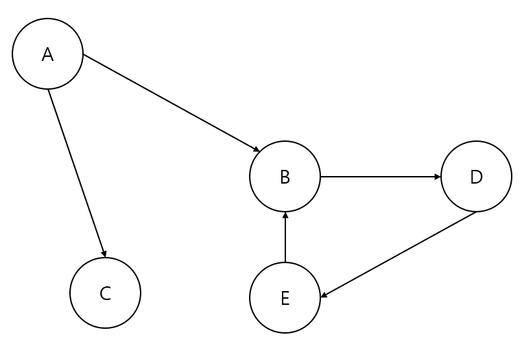

# 의존성과 계층화

모든 소프트웨어는 `의존성(dependency)`를 갖는다. 각 의존성은 같은 기반 코드를 이용하는 코드에 대한 퍼스트파티(first-party) 의존성 및 외부 어셈블리(assembly)에 대한 서드파티(third-party) 의존성이거나 혹은 마이크로소프트 닷넷 프레임워크에 대한 보편적인 의존성일 수 있다.

의존성은 호출자 코드로부터 기능을 추상화한다. 의존성 체인을 제대로 관리하지 못하면 개발자들은 존재할 필요가 없는 의존성 때문에 불필요한 어셈블리 참조로 복잡하게 꼬인 코드를 관리해야 하는 어려움을 겪게 된다.

`변화를 수용할 수 있는 코드를 작성하기 위해서는 의존성을 효과적으로 관리해야 한다.`

의존성은 충분한 학습과 이해를 통해 쉽게 관리될 수 있다. 단기적으로는 애플리케이션을 잘 정리할 수 있도록 도와주는 패턴을 적용하여 장기적으로 변화를 수용할 수 있는 코드를 완성해 나가면 된다.

`계층화(layering)`는 가장 일반적인 아키텍처 패턴 중 하나이며, 이번 장에서는 우리가 선택할 수 있는 여러 계층화 방안과 의존성 관리 기법에 대해 설명할 것이다.

## 의존성의 정의

`의존성(dependency`은 별개의 두 엔티티(entity, 개체) 사이의 연관 관계로 인해 어느 한 엔티티가 다른 엔티티의 기능 없이는 (혹은 존재 없이는) 자신의 기능을 실행하지 못하는 관계를 의미한다.

엔티티는 주로 어셈블리를 의미한다. 어셈블리 A가 다른 어셈블리 B를 사용하고 있다면, A가 B에 의존적이라고 말할 수 있다. A가 B의 클라이언트(client)이고, B는 A의 서비스(service)라고 표현하는 방법이다. B가 없으면 A는 올바르게 기능을 수행하지 못한다. 그러나 여기서 중요한 것은 B는 A에 의존적이지 않다는 점이다. 그리고 앞으로 학습하겠지만 B는 A에 의존적이여서도 안되고 의존적일 수도 없다.


## 간단한 예제

간단한 메시지를 출력하는 콘솔 애플리케이션으로 의존성 문제를 근본적으로 파헤쳐 본다.

1. SimpleDependency라는 콘솔 프로젝트를 생성한다.
2. 솔루션에 MessagePrinter라는 클래스 라이브러리 프로젝트를 추가한다.
3. 콘솔 애플리케이션에서 클래스 라이브러리 프로젝트를 참조한다.

이렇게 한 엄셈블리가 다른 어셈블리를 참조하는 의존성을 갖게 된다.

이 콘솔 애플리케이션은 클래스 라이브러리에 의존적이지만, 클래스 라이브러리는 콘솔 애플리케이션에 의존하지 않는다. 따라서 콘솔 애플리케이션은 클라이언트이고, 클래스 라이브러리는 서비스라고 할 수 있다.

솔루션을 빌드하고 bin 디렉터리를 탐색해 보자. bin 디렉터리를 보면 SimpleDependency.exe와 함께 MessagePrinter.dll 파일 역시 존재하는 것을 알수 있다.

아래와 같이 콘솔 애플리케이션의 `Program.cs`를 수정한다.

```cs
namespcae SimpleDependency
{
    class Program
    {
        static void Main()
        {
            Console.ReadKey();
        }
    }
}
```

솔루션을 다시 빌드하고 애플리케이션을 실행하자. 그러면 콘솔 창이 나타나고 사용자가 키를 입력할 때까지 기다렸다가 키를 입력하는 즉시 애플리케이션이 종료되는 것을 확인할 수 있다. `Console.ReadKey()` 메서드를 호출하는 코드에 중단점을 설정하고 비주얼 스튜디오를 통해 애플리케이션 디버그 모드로 실행해 보자.

상단의 메뉴바에서 디버그 -> 창 -> 모듈 메뉴를 선택해서 보면 앞서 생성했던 클래스 라이브러리들을 볼 수 있다. 하지만 `MessagePrinter.dll` 파일이 로드되어 있지 않은 것을 확인 할 수 있다.

결과 적으로 `의존성을 제공하는 어셈블리가 반드시 미리 로드되어 있을 필요가 없다는 것`이다.

### 프레임워크 의존성

이전에 설명한 의존성을 `퍼스트파티(first-party) 의존성`이라고 한다. 앞 두 프로젝트는 닷넷 프레임워크 어셈블리들에 의존성을 가지고 있다. 이전 버전의 닷넷 프레임워크를 사용하고 있는 프로젝트에서는 참조가 불가능하다. 이러한 의존성을 `프레임워크 의존성`이라 한다.

SimpleDepenency 프로젝트는 닷넷 프레임워크에 대한 여러 가지 참조를 가지고 있다. 이런 의존성의 대부분은 모든 콘솔 애플리케이션 프로젝트가 기본적으로 갖게 되는 의존성이다.

### 서드파티 의존성

`서드 파티 의존성`은 서드파티(thrid-party)개발자에 의해 개발된 어셈블리에 대한 의존성이다. 서드파티 의존성을 선택하는 가장 중요한 이유는, 어떤 기능이나 인프라스트럭처를 직접 구현하느라 많은 노력을 투자하는 대신 이미 만들어진 것을 가져와 적절히 활용할 수 있기 때문이다.

### 서드파티 의존성 정리하기

프로젝트 및 닷넷 프레임워크 외부의 의존성을 정리하기 위한 가장 간단한 방법은 해당 프로젝트의 비주얼 스튜디오 솔류션에 Dependencies라는 이름의 폴더를 만들어 두고 여기에 모든 .dll 파일들을 모아 두는 것이다.

또 다른 방법은 `Nuget`을 이용한 의존성 관리이다. Nuget 의존성 관리 도구는 필요한 모든 것을 포함해 패키지를 내려받거나 어셈블리 참조하기, 라이브러리의 버전을 업그레이드하는 등 프로젝트의 의존성 관리를 위한 여러 기능을 제공한다.

## 유향 그래프를 이용한 의존성 모델링

`그래프(graph)`는 `노드(node)`와 `엣지(edge)`라는 두 가지 요소로 구성된 수학적 구조체이다. 엣지는 두 노드 사이에만 존재할 수 있으며, 이 둘을 연결하는 역할을 한다.


위 그림 처럼 그래프가 방향이 없는 엣지로만 구성되어 있다면 `무향 그래프(undirected graph)` 라고 한다.

아래 그림을 보면 한쪽 끝에 화살표가 있음을 볼 수 있다. 이를 통해 엣지의 방향을 알 수 있다. 이 그래프에는 A에서 C로 향하는 엣지는 있지만, C에서 A로 향하는 엣지는 존재하지 않는다. 이런 그래프를 `유향 그래프` 혹은 `다이그래프(digraph)`라고 한다.


엔티티를 노드라고 생각하면 종속적인 코드에서 의존성을 제공하는 코드로 방향이 있는 엣지를 그릴 수 있다. 이 방법으로 나머지 엔티니들을 그려 나가면 그것이 바로 `의존성 다이그래프(dependency digraph)`가 되는 셈이다.

### 순환 의존성

그래프 이론에서 발견할 수 있는 다른 사항은 방향을 가진 그래프는 순환되는 형태가 될 수 있다는 점이다. 한 노드에서 다른 노드를 탐색할 수 있는 기능으로 인해 엣지를 따라가다가 자기 자신으로 되돌아오는 것도 가능하기 때문이다. 지금까지의 그래프는 소위 `비순환식 다이그래프 (acyclic digraph)`, 즉 순환하지 않는 그래프였다.

아래의 그림은 `순환식 다이그래프(cyclic digraph)`를 보여 준다.



이 노드들이 어셈블리를 표현한다고 가정한다면 D는 자신이 명시적 또는 묵시적으로 참조하는 모든 어셈블리들의 의존성에 대해 묵시적인 의존성을 갖는다.

이셈블리의 경우, 이는 실제로 불가능하다. 만일 비주얼 스튜디오에서 이와 같은 형태로 프로젝트를 구성하고서 B에서 E에 있는 참조를 대입하려 하면 비주얼 스튜디오는 오류 메시지를 출려갛고 이를 거부한다.

`루프(loop)`는 다이그래프 내의 순환 중에서도 조금 특별한 것이다. 어떤 노드의 엣지가 자기 자신에게 연결되어 있는 경우가 바로 해당 노드가 루프가 되는 경우이다.


실제로, 어셈블리는 항상 명시적으로 자립이 가능해서 특별히 자기 자신을 참조하는 경우에 대해서 관찰할 필요는 없다. 그러나 메서드 수준에서 루프는 `재귀(recursion)` 현상이 발생하고 있다는 증거가 된다.

```cs
namespace Graphs
{
    public class RecursionLoop
    {
        int x = 6;
        Console.WriteLine("{0} != {1}", x, B(x));
    }

    public int B(int number)
    {
        if(number ==0)
        {
            return 1;
        }
        else
        {
            return number * B(number -1);
        }
    }
}
```

위 예제는 그전 그림과 같이 의존성 그래프와 기능적으로 동일한 코드를 보여 준다. 메서드 A가 메서드 B를 호출하므로 우리는 메서드 A가  메서드 B에 의존적이라고 할 수 있다. 그러나 메서드 B는 자기 자신에 대해 의존성을 가지고 있다. 즉, B는 자기 자신을 호출하는 재귀 함수의 예라고 할 수 있다.