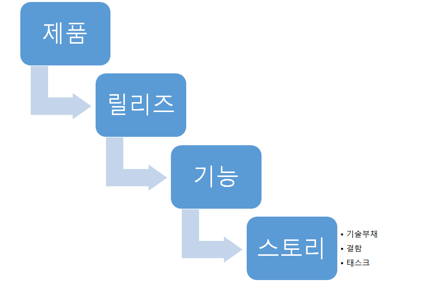
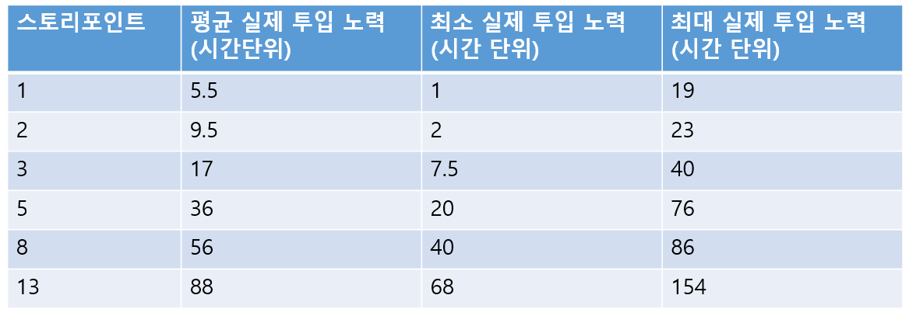
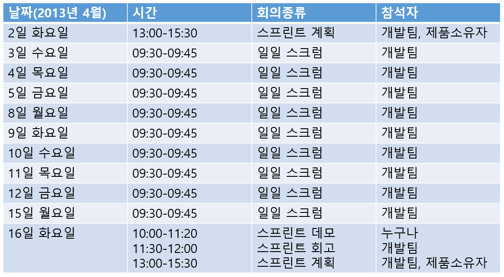

# chapter1

### 3. 산출물

#### 개념

1. 프로젝트의 성공을 위해 반드시 필요한 것을 제외하고는 문서의 양을 줄이는 것을 목표
2. 코드로 문서 대신

#### 스크럼 보드

1. 스크럼보드: 현재 개발이 진행 중인 상태에 대한 스냅샷 
   

2. 카드: 아주 작은 태스크로부터 물리적인 소프트웨어의 릴리즈에 이르기까지 소프트웨어 제춤의 진도를 나타내는 개별적인 요소를 표현

   - > ##### 구성의 계층구조
     > 
     >
     > - 제품
     > - 릴리즈: ex) 구글 크롬 브라우저 작은크기의 릴리즈들이 아무런 표시 없이 데스크톱에 끊임없이 배포
     > - 기능: 필수, 선호, 바람
     > - [+사용자 스토리+] 
     >   [사용자 역할]로서, 나는 [동사 위주의 행위]를 함으로써 [사용자에게 제공할 가치]를 얻고자 한다.
     >   전체 소프트웨어 개발 주기를 축소하여 각각의 스토리에 적용하는 것
     > - 태스크: 스토리는 여러개의 관리 가능한 태스크로 분리되어 스토리에 배정된 개발자들에게 할당
     > - 기술 부채: 스토리가 스크럼보드를 통해 진행되는 동안 만들어지는 디자인과 아키텍처의 타협을 의미하는 단어.
     > - 결함: 이미 완료된 사용자 스토리가 수렴 가능한 조건을 만족하지 못할 때마다 생성 
     >   심각한 결함: 애플리케이션이 완전하게 실패하거나 혹은 사용자가 작업을 계속 할 수 없도록 하는 결함 
     >   행위오류: 아주 심각하지는 않지만 사용자의 짜증을 유발 
     >   표현이슈: 주로 사용자의 인터페이스에서 발생하는 문제 

3. 스윔레인: 스토리 보드에는 스윔레인을 구분하기 위해 수직으로 선

   - 특징
     - 왼쪽에서 오른쪽 방향으로 이동
     - 구성: 백로그, 진행중, QA 및 완료
     - 한 레인 안에서도 우선순위

4. 기술부채: 사용자 스토리를 구현하는 과정에서는 언제든지 이상적인 코드와 마감일을 맞추기에는 충분한 수준의 코드 사이의 타협이 발생

   - 좋은 기술부채와 나쁜 기술부채
   - 기술부채의 사분면 
      

5. 디지털 스크럼 보드

6. 완료에 대한 정의

#### 차트와 측정(진척도 모니터링)

1. [+스토리 포인트+]: 사용자 스토리가 표현하는 특정 기능을 구현하는데 필요한 상대적인 노력의 정도

2. 속도: 스토리 포인트를 당성하기 위해 평균적으로 소요되는 시간을 계산

   - 팀의 속도: 다음 스프린트에 팀이 커밋해야 할 포인트의 한계치
   - 소프트웨어 출시에 대한 문제를 분석

3. [+스프린트 번다운 차트+]

   - 스프린트 기간에 스토리 포인트를 추적하기 위한 것
   - 스프린트 시작 시점: 스프린트 번다운 차트
   - 직선: 스프린트 목표에 대한 최적선

4. 기능 번업 차트
   - 기능들의 완료도 표시
   - 그래프에 표시되지 않은 채 기능이 완료된 것처럼 눈속임 불가
   - 

#### 백로그: 아직 시작되지 않은 대기 작업들의 목록

1. 제품백로그: 제품의 개발주기 동안 구현해야 할 기능
2. 스프린트백로그: 해당 스프린트 내에 완료해야 할 모든 사용자 스토리 관리

### 4. 스프린트

#### 개념

1. 스프린트: 스크럼 프로젝트의 반복되는 작업 주기
2. 단위: 대부분 2주
3. 월 시작 ~ 금마감 스프린트의 문제점 : 회의의 대부분을 스프린트 회고가 차지 
   => 주중에 시작하고 끝

#### 출시계획

1. 출시계획
   - 소프트웨어의 출시 계획
   - 고객과 제품 소유자가 출시일을 결정하고 해당 출시 계획에 포함될 기능의 우선순위와 크기를 결정

2. 기능예상: 어느정도 노력을 투입할 지 정확하게 예측하는 일
   티셔츠의 크기로 표현: XL/L/M/S/XS
3. 기능 우선순위: 제품을 출시할 때 몇 개의 기능을 추가하는 것이 적합할지 예측하는 것
   - 필수: 제품의 출시에 반드시 포함되어야 할 기능
   - 선호:  작업 마감일 이전에 시간적 여유가 있다면 출시에 포함해야 할 기능
   - 희망: 기본적으로 이번 출시에 포함되지 않지만 고객은 이 기능이 구현되기를 바람

#### 스프린트 계획                                                                                                                                                                                      

1. 스프린트 계획

   - 결과물: 예상 스토리 포인트
2. 플래닝 포커
   - 참여자: 스크럼 마스터와 제춤 소유자를 포함한 전체 개발팀

   - 방법: 제품 백로그에 나열된 모든 사용자가 스트리에 대해 간략한 설명을 한 후 모든 사람이 해당 스토리에 어느정도의 스토리 포인트를 할당 할 것인지 투표

   - 선택할 수 있는 점수 제한: 이유 여러 사람이 제한한 스토리 포인트 사이에 근소한 차이가 발생하는 것을 피라기 위해 (일반적으로 피보나치수열)

   - 과정: 평균값에서 거리가 먼 사람의 의견 수렴 및 토론

   - 종료: 각 스토리에 할당된 포인트릐 총합이 팀이 한 스프린트 내에 완료할 수 있는 속도 점수에 도달할 때까지 반복

   - ###### 

3. 상대예측
   - 작업할 스토리에 개수가 많은 경우 투입해야 할 시간의 양을 예상하는 방법                                                                               
   - 방법: 제춤 백로그의 맨 위에 있는 두개의 스토리를 가져와 둘 중 어느 것이 더 작은 것인지 크기 결정
   - 과정: 작은 스토리 왼쪽 큰 스토리 오른쪽
   - 종료: 왼쪽 작은 스토리부터 오른쪽 큰스토리까지 진행

#### 일일 스크럼

1. 일일스크럼

   - 스크럼 보드 앞에 말발굽 형태로 모여 각 구성원이 순서대로 팀 전체를 대상으로 자신의 상황 공유

   - 15분 이내

   - 질문

     - 어제 진행한 업무는 무엇인가
     - 오늘 진행할 업무는 무엇인가
     - 현재 당면한 방해 요소는 무엇인가

   - 주의: 대화의 주제에 벗어나지 않도록

     > 니코-니코 달력(분위기 보드)
     >
     > - 스프린트를 진행하는 동안 팀의 분위기를 보여주는 바로미터를 제공
     >
     > - 예시 
     >   
     >
     >   

#### 스프린트 데모

1. 스프린트 데모
   - 개념: 완료된 스토리가 실제 환경에서 동작하는 것을 보여주기 위한 회의
   - 과정
     - 스크럼 보드에서 완료된 모든 사용자 스토리를 하나씩 모음
     - 개별적으로 스토리의 범위와 전체 프로젝트의 일부로서 이 스토리를 통해 달성하는 의도가 무엇인지를 설명
     - 스토리와 관련된 기능을 소개하고 이를 구현하는 과정에서 애플리케이션의 변경된 기능을 소개
     - 데모를 시작하기에 앞서 코드 변경을 금지할 시간을 정해두기

#### 스프린트 회고

1. 스프린트 회고
   - 개념: 작업주기를 되돌아보고 전체적인 성공 여부에 대한 의견을 교환
   - 과정
     - 긍정적인 내용
     - 개선했어야 할 점
     - 미처 예상하지 못했던 일
2. 스토리 포인트 삼각법
   - 개념: 가상의 프로젝트에 예상 스토리 포인트 대비 실제로 투입된 노력의 평균, 최소, 최대값
   - 예시 
     

#### 스크럼 일정표

스프린트 양도일: 스프린트를 끝낼때와 새로운 스프린트를 시작할 때는 거의 하루종일 회의가 이루어짐.