# Chapter2 

### 2. 의존성 관리하기

#### 추종자 안티패턴

> ##### 안티패턴
>
> 코드의 유연성을 해치기 때문에 사용을 지양해야하는 패턴

1. 개념
   - 뭔가 단순한 것을 요구했는데 관련된 모든 것들이 뒤따라오는 상황에서 비롯된 이름
   - 유명 가수나 영화배우들에게는 이들을 줄기차게 쫓아다니는 광팬들이 많은 것과 같은 이치
   - **원치 않은 의존성을 관리해야하는 상황**을 최대한 적절하게 설명하기 위해 필자가 고안
   - **[+인터페이스와 그에 관련된 의존성들은 동일한 어셈블리에 존재해서는 안됨.+]**


2. 예시
   - 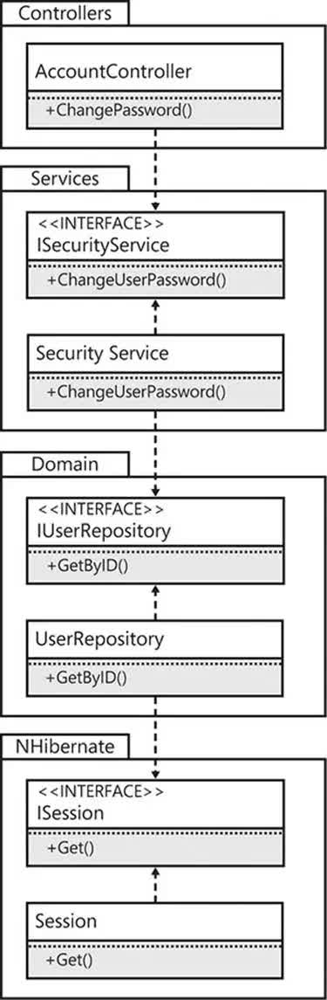
   - 인터페이스의 구현이 인터페이스 자체와 동일한 어셈블리에 존재
   - 묵시적 의존성이 존재
   - bin 디렉토리에서 NHibernate 관련 어셈블리 발견
3. 실습(01. Entourage anti-pattern)
   - 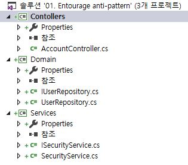
   - AccountController Build 시 bin폴더
     - 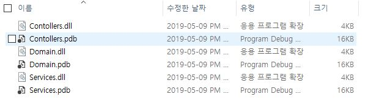<br>
     - Domain.dll 발견 => [+묵시적 의존성+]

4. 문제점
   - 실제 구현 클래스들이 public이기 때문에 프로그래머가 직접 조합해 사용가능 => 교육이 필요
     - Controller => Domain 직접 사용 가능
   - 또 다른 의존성 추가시 기반 코드의 덩치가 커지고 깨지기 쉬워져 결과적으로 새로운 요구사항을 수렴하기 어려움.
   - 따라서 계단 패턴을 사용하자.

#### 계단패턴

1. 개념

   - **인터페이스와 실제 구현 클래스를 서로 다른 어셈블리에 정의함으로써 두 어셈블리를 독립적으로 관리할 수 있고 클라이언트는 인터페이스 어셈블리 하나만 참조하게 만들 수 있다.** 

2. 예제

   - 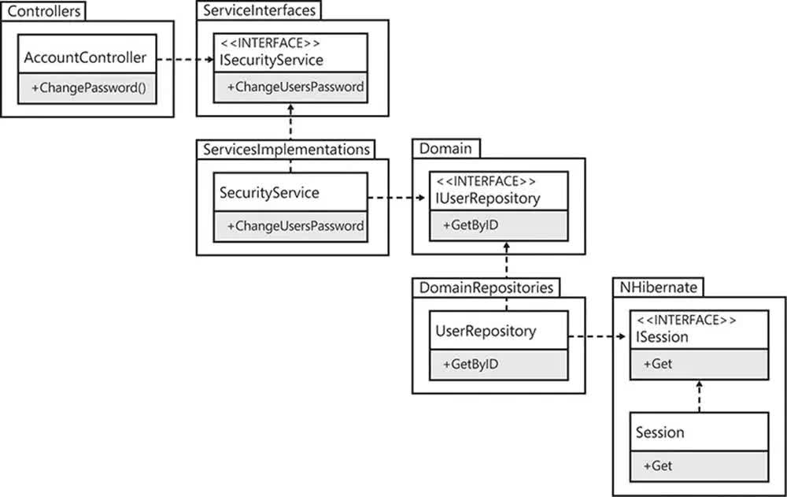

   - 각 클래스는 자신이 의존하는 인터페이스가 정의된 어셈블리만을 참조
   - 인터페이스는 어떠한 외부 의존성도 가져서는 안됨.

3. 실습(02. Stairway pattern)

   - 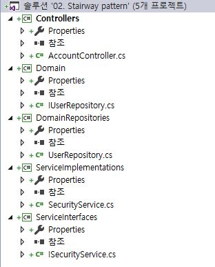
   - AccountController Build 시 bin폴더
     - 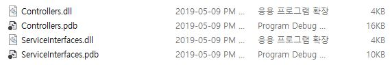
     - ServiceInterface dll만 참조
     - Controller와 Service 독립적으로 관리

4.  서드파티 라이브러리 추종자 안티패턴 사용 문제 해결

   - 인터페이스를 직접 정의하여 참조
   - 서드파티에 대한 의존성을 퍼스트파티 의존성을 이용해 숨기는 간단한 인터페이스 정의
   - 직접적인 해결책은 아님
   - 양이 많고 유지보수 어려움

#### 의존성 해석하기

1. 어셈블리

   - 해석 프로세스: 프로젝트나 어셈블리에 추가된 참조와 이 어셈블리들을 로드하여 실행되는 애플리케이션 사이의 간극을 메우는 역할

     - 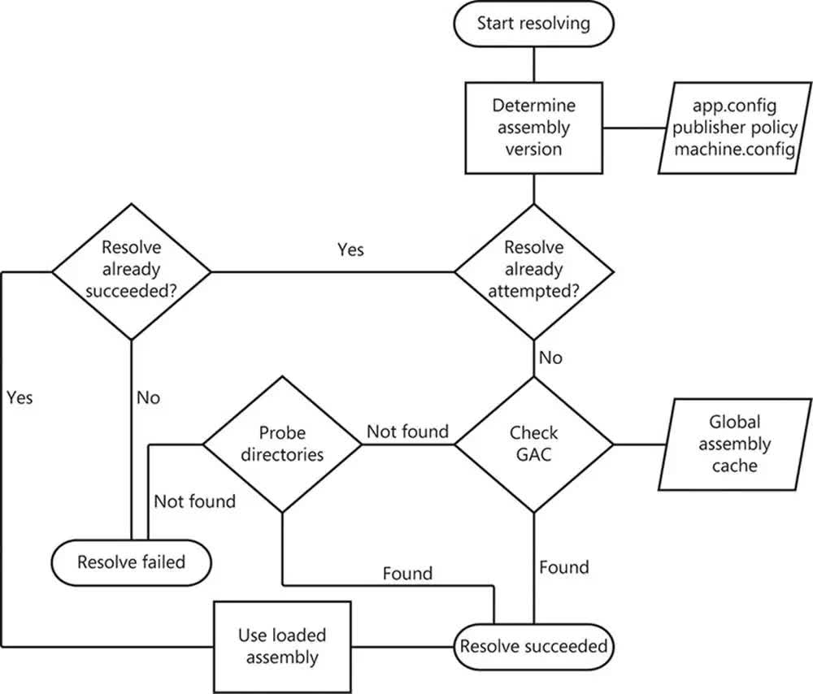

       > **해석프로세스**
       >
       > 1. JIT 모델을 이용해 어셈블리 해석 => 해석 시점: 애플리케이션 시작 시점이 아니라 기능을 처음 사용할 때
       >
       > 2. 어셈블리 식별자 확보 => 어셈블리는 고유 값을 가짐
       >
       >    - app.config
       >
       >    - ```xml
       >      <dependentAssembly>
       >        <assemblyIdentity name="Newtonsoft.Json" publicKeyToken="30ad4fe6b2a6aeed" culture="neutral" />
       >        <bindingRedirect oldVersion="0.0.0.0-12.0.0.0" newVersion="12.0.0.0" />
       >      </dependentAssembly>
       >      ```
       >
       > 3. 어플리케이션을 실행된 후 동일한 의존성에 대한 해석이 시도된 적이 있는지 판단
       >
       > 4. 해석 시도 후 해석 성공 => 로드된 어셈블리 사용 => 해석 성공
       >
       > 5. 해석 시도 한 적이 없음. => GAC(Global Assembly Cache) 검사 후 발견 되면 해석 성공
       >
       > 6. 해석 시도 한 적이 없음. => GAC(Global Assembly Cache) 검사 후 발견 안되면
       >    bin 디렉토리 탐색으로 어셈브리 찾기

   - 퓨전로그: CLR이 런타임 시점에 실패했던 어셈블리 바인딩을 디버깅하기 위한 매우 유용한 도구

2. 서비스: 클라이언트와 서비스의 결합은 비교적 느슨한 결합

   - **알려진 종단점**(클라이언트 코드에 서비스 프록시 객체 생성)

   > - 서비스 참조 추가<br>
   >   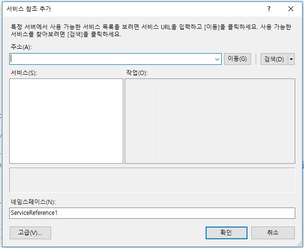
   >
   >   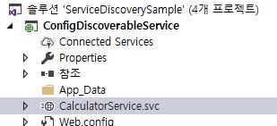
   >
   > - 서비스 프록시 직접 구현
   >   System.ServiceModel.dll 추가
   >   ChannelFactory 클래스 이용 => 주소, 바인딩, 계약
   >
   >   ```csharp
   >   static void Main(string[] args)
   >   {
   >       var foundEndpoints = FindEndpointsByContract<ICalculator>();
   >   
   >       if (!foundEndpoints.Any())
   >       {
   >           Console.WriteLine("No endpoints were found.");
   >       }
   >       else
   >       {
   >           var binding = new BasicHttpBinding();
   >           var channelFactory = new ChannelFactory<ICalculator>(binding);
   >           foreach (var endpointAddress in foundEndpoints)
   >           {
   >               var service = channelFactory.CreateChannel(endpointAddress);
   >               var additionResult = service.Add(a, b);
   >               Console.WriteLine("Service Found: {0}", endpointAddress.Uri);
   >               Console.WriteLine("{0} + {1} = {2}", a, b, additionResult);
   >           }
   >       }
   >   
   >       Console.ReadKey();
   >   }
   >   ```
   >
   >   

   - 서비스 발견: 서비스가 어디서 호스팅되고 있는지

     - > **관리되는 방식**
       >
       > 서비스 발견 프록시 => 문제 생기면 클라이언트는 그 어떤 서비스도 탐색이 불가능하므로 어떤 서비스에도 접근 불가능
       >
       > **애드혹 방식**
       >
       > 멀티개스트 네트워크 메시지를 전달하므로 서비스 발견 프록시가 필요하지 않음.
       >
       > ```xml
       > <behavior name="calculatorServiceDiscovery">
       >   <serviceDiscovery />
       > </behavior>
       > 		
       > <services>
       >   <service name="ConfigDiscoverableService.CalculatorService" behaviorConfiguration="calculatorServiceDiscovery">
       >     <endpoint address="CalculatorService.svc" behaviorConfiguration="calculatorHttpEndpointDiscovery" contract="ServiceContract.ICalculator" binding="basicHttpBinding" />
       >     <endpoint kind="udpDiscoveryEndpoint" />
       >       <!--표준 엔드포인트-->
       >   </service>
       > </services>
       > ```
       >
       > 

   - Restful 서비스
     - ApiController 상속
     - HTTP 동사 지원
     - Client와 Server 간의 의존성이 줄어 든다.
     - 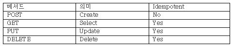
     - 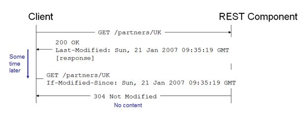

#### Nuget을 이용한 의존성 관리

1. 패키지 사용하기

   - 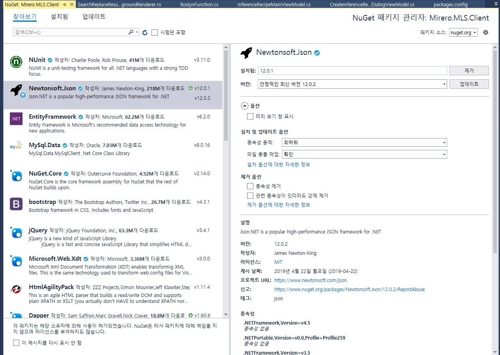

   - package 폴더

     - 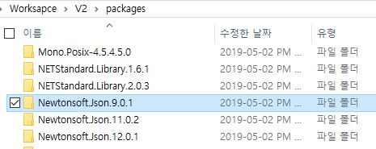

   - App.config

     ```xml
     <dependentAssembly>
        <assemblyIdentity name="Newtonsoft.Json" publicKeyToken="30ad4fe6b2a6aeed" culture="neutral" />
        <bindingRedirect oldVersion="0.0.0.0-12.0.0.0" newVersion="12.0.0.0" />
     </dependentAssembly>
     ```

   - 참고 (<http://wish.mirero.co.kr/mirero/project/ros/2.0/h19-secsrd-ros20-03/hrms/snippets/71>)

2. 패키지 만들기(<https://docs.microsoft.com/ko-kr/nuget/create-packages/creating-a-package>)
3. Chocolatey:  애플리케이션과 도구를 패키지로 관리하는 도구
   - 다양한 애플리케이션 및 도구들을 검색하고 설치가능
   - 파워쉘을 통해 chocolatey 다운 설치 가능
   - <https://chocolatey.org/docs/installation>

### 3. 계층화

#### 계층화

1. 두개의 계층<br>
   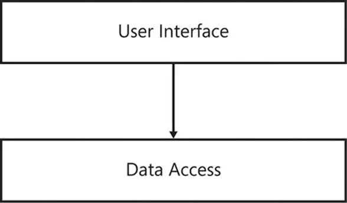
   - UserInterface: UI, 유효성 검사
   - DataAccess: 데이터 질의

2. 세개의 계층<br>
   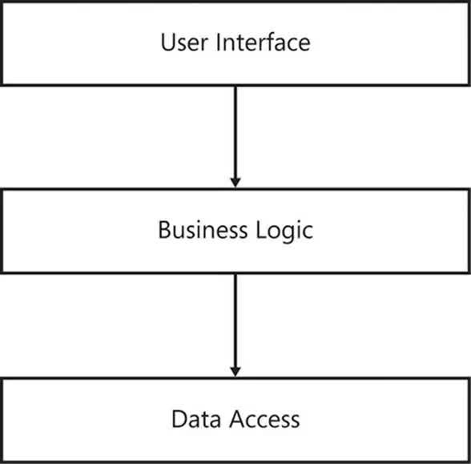
   - 비즈니스 로직: 규칙, 흐름

#### 횡단 관심사

1. 수동

   ```csharp
   public void OpenNewAccount(Guid ownerID, string accountName, decimal openingBalance)
   {
       log.WriteInfo("Creating new account for owner {0} with name '{1}' and an opening
      balance of {2}", ownerID, accountName, openingBalance");
   
       using(var transaction = session.BeginTransaction())
       {
           var user = userRepository.GetByID(ownerID);
           user.CreateAccount(accountName);
           var account = user.FindAccount(accountName);
           account.SetBalance(openingBalance);
   
           transaction.Commit();
       }
   }
   ```

   2. AOP => 의존성 제거

      ```csharp
      [Logged]
      [Transactional]
      public void OpenNewAccount(Guid ownerID, string accountName, decimal openingBalance)
      {
          var user = userRepository.GetByID(ownerID);
          user.CreateAccount(accountName);
          var account = user.FindAccount(accountName);
          account.SetBalance(openingBalance);
      }
      ```

      #### 비대칭 계층화

      1. 명령, 질의 분리(CQS)

         ```csharp
         // Compliant command
         Public void SaveUser(string name)
         {
             session.Save(new User(name));
         }
         // Compliant query
         Public IEnumerable<User> FindUserByID(Guid userID)
         {
             return session.Get<User>(userID);
         }
         ```

         2. 명령 직의 책임 격리(CQRS):  명령과 질의는 각각 가장 잘 처리할 수 있는 계층화의 경로를 따를 필요가 있음.

            - DB 에서 데이터를 읽는 시점과 화면에 렌더링 하는 시점은 반드시 차이가 생기기 마련이며, 렌더링 하는 데이터는 이미 실제 데이터와 차이가 생길 수 있다 라는 점

            - Read와 Update 분리

            - 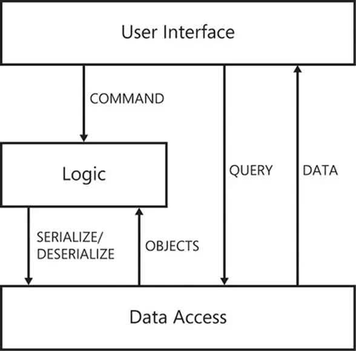

              

