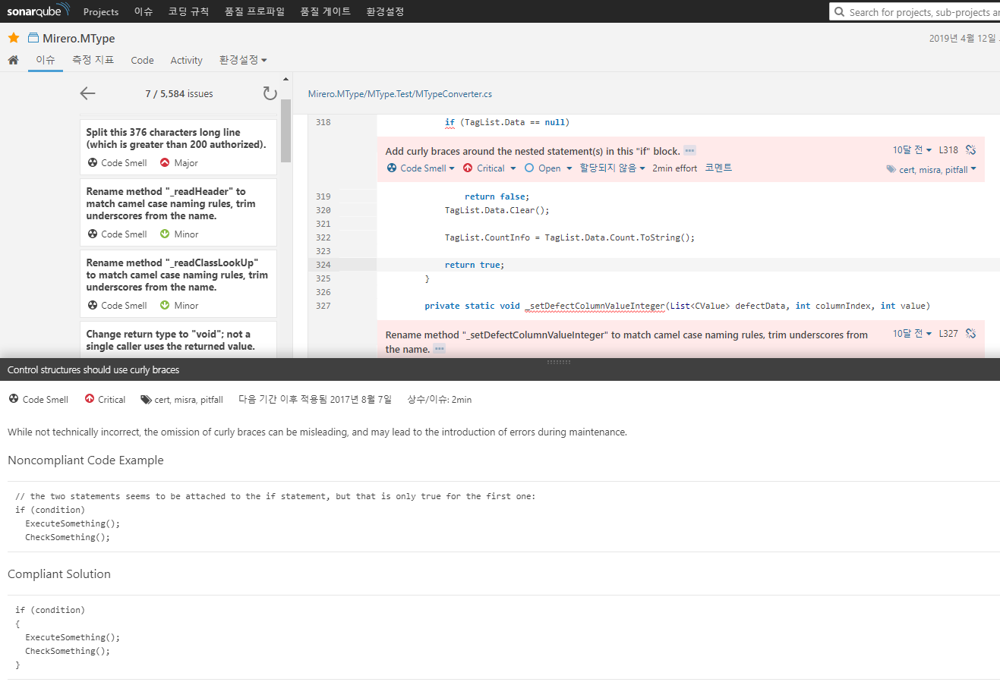

## 구현과 인터페이스의 비교

- 컴파일시에는 인터페이스의 클라이언트는 해당 인터페이스에 대한 어떤 구현체가 사용되고 있는지에 대해 알 필요가 없음

- 알게된다면 오히려 잘못된 가정으로 인해 인터페이스의 특정 구현체와 클라이언트 사이의 의존성이 더 높아지게 됨 


## new키워드의 코드 스멜


- 인터페이스  -> 어떤 일을 수행할 수 있는지를 서술
- 클래스 -> 어떻게 특정 작업을 수행할 것인지 서술, 실제 구현에 대한 상세 내용은 클래스만 알고 있음. 


> 코드 스멜(code smell) 
>
> - 어떤 코드가 잠재적으로(potentially)문제가 있음을 표현하는 단어
>
> - 동일한 코드 스멜이 두군데서 발견된다고해서 항상 똑같이 문제가 발생한다고 볼 수는 없다.
>
> - 코드 스멜은 뭔가 잘못될 가능성이 있음에 대한 경고이며, 어떤 문제가 발생할 경우 그에 대한 근본적 원인이 된다.





```csharp
public class AcountController
{
    private readonly SecurityService securityService;

    public AccountController()
    {
        this.securityService = new SecurityService();
    }

    [HttpPost]
    public void ChangePassword(Guid userID, string newPassword)
    {
        var userRepository = new UserRepository();
        var user = userRepository.GetByID(userID);
        this.securityService.ChangeUsersPassword(user, newPassword);
    }
}
```

객체의 인스턴스를 직접 생성함으로 인해 코드의 적응성이 저하되는 예제 


AccountController 클래스는 가상의 ASP.NET MVC 애플리케이션에 구현된 클래스

두번의 new 키워드 사용은 다음 문제점들의 직접적인 원인 

- AccountController 클래스는 SecurityService 클래스와 UserRepository 클래스의 구현에 대해 영원히 의존적
- SecurityService 클래스와 UserRepository 클래스가 가지고 있는 의존성은 Account Controller 클래스의 잠재적 의존성
- AccountController는 단위 테스트를 하기가 어려움. 평범한 방법으로는 의존하고 있는 두 클래스의 모의 객체(mocking object)를 만들 수 없기 때문이다. 
- SecurityService.ChangeUserPassword 메서드는 클라이언트가 User 객체를 로드할 수 밖에 없도록 만듬


SecurityService 클래스의 구현을 변경할 수 있는 방법 두가지

- AccountController가 새롭게 구현한 클래스를 사용할 수 있도록 수정
- 기존의 SecurityService 클래스에 새로운 기능을 추가 


```csharp
[HttpPost]
public void ChangePassword(Guid userID, string newPassword)
{
    this.securityService.ChangeUsersPassword(userID, newPassowrd);
}
// ...
public void ChangeUsersPassword(Guid userID, string newPassword)
{
    var userRepository = new UserRepository();
    var user = userRepository.GetByID(userID);
    user.ChangePassword(newPassword);
}
```

SecurityService 클래스의 클라이언트를 향상시키기 위한 코드 


- AccountController 클래스는 개선되지만, ChangeUsersPassword 메서드는 UserRepository 객체의 인스턴스를 직접 생성하는 문제점을 여전히 가지고 있다.


## 객체 생성에 대한 대안

### 인터페이스를 기초로 한 코딩

- SecurityService 클래스의 실제 구현을 인터페이스 뒤로 숨긴다. 
- AccountController 클래스가 SecurityService 클래스의 실제 구현체가 아닌 인터페이스에만 의존하게 만든다.


1. SecurityService클래스로부터 인터페이스 추출

```csharp
public interface ISecurityService
{
    void ChangeUserPassword(Guid userID, string newPassword);
}
// ...
public class SecurityService : ISecurityService
{
	public ChangeUsersPassword(Guid userID, string newPassowrd)
    {
    	// ...
    }
}
```


2. 클라이언트 코드가 더 이상 SecurityService 클래스를 참조하지 않고 ISecurityService 인터페이스를 대신 참조하도록 수정

```csharp
public class AccountController
{
    private readonly ISecurityService securityService;

    public AccountController()
    {
        this.securityService = new SecurityService();
    }

    [HttpPost]
    public void ChangePassword(Guid guid, string newPassword)
    {
        securityService.ChangeUsersPassword(user, newPassword);
    }
}
```


### 의존성 주입 기법 활용하기 

```csharp
public class AccountController
{
    private readonly ISecurityService securityService;

    public AccountController(ISecurityService securityService)
    {
        if (securityService == null) throw new ArgumentNullException("securityService");

        this.securityService = securityService;
    }

    [HttpPost]
    public void ChangePassword(Guid guid, string newPassword)
    {
        securityService.ChangeUsersPassword(user, newPassword);
    }
}
```


- securityService를 직접 생성하는 대신, 다른 클래스에게 ISecurityService 인터페이스를 구현한 객체를 제공해 줄 것을 요구
- 의존성이 완전히 제거됨

```csharp
publiic class SecurityService : ISecurityService
{
	private SecurityService(IUSerRepository userRepository)
    {
    	if (userRepository == null) throw new ArgumentNullException("userRepository");
        this.userRepository = userRepository;
    }

	public ChangeUsersPassword()
    {
    	var user = userRepository.GetByID(userID);
        user.ChangePassword(newPassword);
    }
}
```


