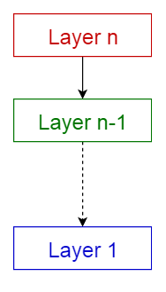
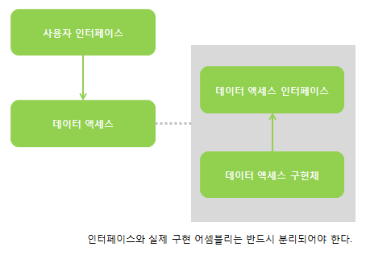
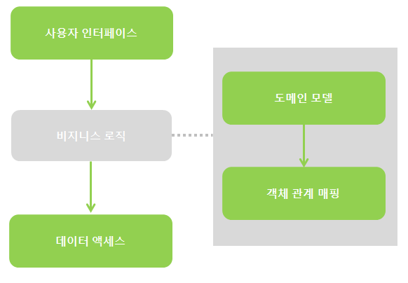
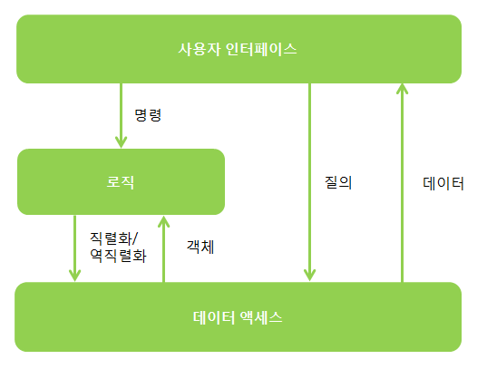
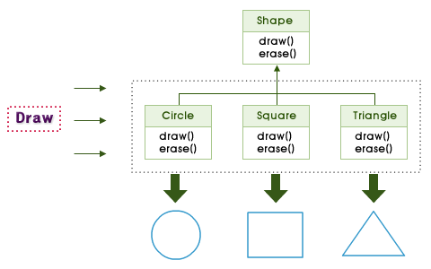

## 계층화
동일한 규칙, 즉 다이그래프의 단방향성을 유지하고 한 가지 역할만을 수행하도록 구현해야 한다.  
계층화는 소프트웨어 컴포넌트를각 기능의 수평적 계층으로 취급하고 이들을 바탕으로 전체 애플리케이션을 구성해 나가도록 유도하는 아키텍처 패턴이다.  
컴포넌트는 계층화되어 어느 하나가 다른 컴포넌트의 상위에 위치할 수 있으며, 의존성 방향은 항상 아래를 향하게 된다.  
이는 최하위 계층은 어떤 의존성도 갖지 않음을 의미하며, 각 계층의 상위 계층은 바로 아래 계층에 대한 의존성을 갖는다.



###  일반적인 패턴
특정한 요구 사항과 상황의 제약에 따라 적절하게 변형해서 사용하면 된다.  
솔루션을 몇 개의 계층으로 나눌 것인지는 솔루션의 복잡도에 달렸고, 솔루션의 복잡도는 문제의 복잡도와 관련이 있다.  
여기서 복잡도는 여러 요건들을 통해 산출이 가능하다. 그 여건이란 것에는 프로젝트의 시간적 제약, 프로젝트의 존속 기간, 요구 사항의 변경 빈도, 그리고 팀이 패턴의
적용과 숙련을 얼마나 중요하게 생각하는가 등 몇가지가 있다.  
<br>

#### 두 개의 계층

여기서 두 계층이란, 사용자 인터페이스 계층과 데이터베이스 계층을 의미한다.  
두 개의 어셈블리만을 사용핸다는 의미가 아니라 사용자 인터페이스와 데이터 액세스에 각각 집중하는 두 개의 논리적인 어셈블리 집합을 구성한다는 뜻이다.



>사용자 인터페이스

데이터 액세스 계층 위에 존재하며, 하위 계층의 기능을 사용할 수 있다.  
이 때, 사용자 인터페이스 계층은 데이터 액세스 계층을 구현한 어셈블리를 직접 참조할 수 없다.  
각 계층의 인터페이스와 실제 구현 어셈블리는 반드시 분리되어야 한다.
- 사용자가 애플리케이션을 사용하기 위한 방법을 제공한다.
-  사용자에게 데이터와 정보를 표시한다.
- 사용자의 요청을 질의나 명령 형태로 받아들인다.
- 사용자가 입력한 정보에 대한 유효성을 검사한다.

> 데이터 액세스

데이터 액세스 계층은 여러 기술에 대한 의존성을 전혀 갖지 않는 인터페이스에 의해 최대한 가려져야 한다.  
모든 인터페이스는 서드파티에 대한 의존성을 갖지 않아야만 클라이언트가 선택한 그 어떤 기술과도 분리하여 사용할 수 있다.
- 데이터에 대한 질의를 제공한다.
- 객체 모델과 관계형 모델 간의 직렬화/역직렬화를 수행한다.

> 장점

- 약간의 유효성 검사를 제외하고는 애플리케이션 로직이 거의 또는 아예 존재하지 않는 경우.  
데이터 액세스 계층이나 사용자 인터페이스 계층을 손쉽게 캡슐화할 수 있다.
- 애플리케이션이 주로 데이터에 대한 CRUD 작업만을 수행하는 경우.  
생성, 조회, 수정 및 삭제 작업은 사용자 인터페이스와 데이터 사이에 다른 계층이 존재하면 오히려 더 어려운 작업이 될 수 있다.
- 기간이 짧은 경우. 프로토타입이나 데모용 애플리케이션을 개발하는 경우 계층의 수를 제한하면 많은 시간을
절약 할 수 있으며, 개념 증명을 통한 실현 가능성을 빠르게 확인 할 수 있다. 

> 단점

- 애플리케이션이 방대한 로직을 가지고 있거나 로직의 주제가 변경되는 경우.  
사용자 인터페이스 계층과 데이터 계층에 적용된 로직은 기술적으로 해당 계층의 순수성을 해치며 유연성과 유지보수성을 저하시킨다.
- 애플리케이션이 한두 번의 스프린트를 거쳐 두 계층 이상으로 방대해지는 경우.  
아키텍처가 단 몇 주만에 바뀌게 된다면 빠른 피드백을 얻기 위해 감수했던 부분들은 그 가치를 상실하게 될 뿐인다.

#### 세 개의 계층
사용자 인터페이스와 데이터 액세스 계층 사이에 추가 계층을 삽입한 아키텍처이다.  
로직 계층을 추가하여 보다 복잡한 처리를 캡슐화 하는 것이다.

 

> 비지니스 로직

도메인 모델은 하위 계층은 물론 특정 구현 기술에 대한 의존성이 반드시 제거되어야 한다.
- 사용자 인터페이스 계층으로부터의 명령을 처리한다.
- 비지니스 도메인을 모델링하여 비지니스 프로세스, 규칙, 업무 흐름 등을 정의한다.

### 횡단 관심사
컴포넌트의 역할을 하나의 계층으로 제한하기가 쉽지 않은 경우가 있다.  
감사나 보안 그리고 캐시 등은모든 계층에 사용되기 때문에 애플리케이션 전체에 적용되어야 한다.
``` c
public void OpenNewAccount(Guid ownerID, string accountName, decimal openingBalance)
{
    log.WriteInfo("고객 {0}의 새 계층 {1} 생성, 최초 입금액 {2}, ownerID, accountName, openingBalance");
    using(var taransaction = session.BeginTransaction())
    {
        ...

        transaction.Commit();
    }
}
``` 

이 방법은 실수를 범하기 쉬우며, 모든 메서드에 불필요하고 장황한 코드를 추가해야 해서 코드가 지저분해 보인다.  
이 방법 대신에 이러한 횡단 관심사의 요건들을 정의하고 이들을 캡슐화된 기능으로
떼어 내어 코드에 적용하면 코드에 대한 간섭을 최소화할 수 있다. => 관점지향 프로그래밍 기법 사용

#### 관점
관점지향 프로그래밍(AOP)은 횡단 관심사를 코드 내의 여러 계층에 적용하는 방법이다.
``` C
[Logged]
[Transactional]
public void OpenNewAccount(Guid ownerID, string accountName, decimal openingBalance)
{
    ...
}
```
Logged 특성은 메서드 호출에 대한 기록을 매개변수의 값과 함께 로그에 기록한다.  
Transactional 특성은 이 메서드를 데이터베이스 트랜잭션으로 감싸고, 메서드 호출이 성공하면 트랜잭션을 커밋하며 실패하면 롤백한다.  
여기서 핵심은 이 두 특성이 모두 충분히 범용적이어서 어느 특정한 메서드 하나가 아니라 원하는 어떤 메서드에 적용이 가능하고 원하는 만큼
재사용이 가능하다는 것이다.

### 비대칭 계층화
애플리케이션에 전달되는 모든 사용자 요청은 사용자 인터페이스를 통해 발생한다.  
하지만 그 요청이 전달되는 경로가 반드시 동일해야 할 필요가 없기 때문에 생성된 요청의 종류에 따라 계층화가 비대칭적으로 이루어질 수 있다.

#### 명령/질의 분리(CQS)

객체의 메서드는 명령 혹은 질의 중 하나여야 한다.  
명령과 질의는 리턴값의 존재 여부로 구분할 수 있다.

> 명령

어떤 동작을 위해서 의무적으로 호출해야하는 것으로, 코드로 하여금 필요한 작업을 실행하게 한다.  
이런 메서드들은 시스템의 상태를 변경할 수는 있지만, 값을 리턴해서는 안 된다.
``` C
// CQS를 준수하는 메서드
public void SaveUser(string name)
{
    session.Save(new User(name));
}

// CQS를 준수하지 않는 메서드
public User SaveUser(string name)
{
    var user = new User(name);
    session.Save(user);
    return user;
}
```

>질의

데이터에 대한 요청이며, 코드로 하여금 필요한 데이터를 가져오게 한다.  
이런 메서드들은 자신을 호출한 클라이언트에게 데이터를 리턴하지만, 시스템의 상태를 변경해서는 안 된다.

``` c
// CQS를 준수하는 메서드
public IEnumerable<User> FindUserByID(Guid userID)
{
    return session.Get<User>(userID);
}

// CQS를 준수하지 않는 메서드
public IEnumerable<User> FindUserByID(Guid userID)
{
    var user = session.Get<User>(userID);
    user.LastAccessed = DateTime.Now;
    return user;
}
```

#### 명령/질의 책임 격리 (CQRS)
CQS 패턴을 아키텍처 수준에 적용한 것으로, 비대칭 계층화의 좋은 예가 된다.  
명령과 질의는 CQS와 동일한 규칙을 따르지만, 한 걸음 더 나아가 명령과 질의는 각각을 가장 잘 처리할 수 있는
계층화의 경로를 따를 필요가 있다는 점을 함께 고려하고 있다.



> 데이터에 대한 질의

빠르게 수행되어야 하며, 트랜잭션 동시성에 대한 보장이 필요치 않다.  
즉, 응답성을 향상시키기 위해 팬텀 읽기나 반복하지 않는 읽기를 허용할 수 도 있다.  
ACID(원자성, 일관성, 격리성, 영속성)를 완벽히 지원하는 데이터베이스를 이용한다.

- 팬텀 읽기: 행 범위의 한 행에 대해 트랜잭션이 삭제 혹은 추가시에 생겨나는 것으로 처음에는 데이터값을 읽어왔다가 다음에는 사라지는 경우나 그 반대의 경우를 말한다.
- 반복하지 않는 읽기: 동일한 데이터를 반복해서 읽어왔을 때 처음 읽어왔던 데이터와 다른 경우가 발생할 수 있는데, 이를 반복하지 않은 읽기라고 한다.
- 원자성: 트랜잭션과 관련된 일은 모두 실행되던지 모두 실행되지 않도록 하던지를 보장하는 특성이다.
- 일관성: 트랜잭션이 성공했다면, 데이터베이스는 그 일관성을 유지해야 한다.
- 격리성, 독립성: 트랜잭션을 수행하는 도중에 다른 연산작업이 끼어들지 못하도록 한다. 
- 영속성: 성공적으로 트랜잭션이 수행되었다면, 그 결과는 완전히 반영이 되어야 한다.


> 명령의 처리

트랜잭션 동시성이 보장되어야 한다. 고로 명령과 질의의 처리는 다른 계층을 통해 실행되어야 한다.  
간단한 도큐먼트 저장소를 사용할 수 있다.  
도큐먼트 저장소는 명령 측 영역에서 발생한 이벤트에 의해 비동기적으로 업데이트 되어 질의 측 영역에 최종적 일관성을 적용할 수 있다.


-----------

## 인터페이스란 무엇인가?
인터페이스는 클래스가 가지는 동작을 정의하지만, 실제로 이 동작을 구현하지 않는다.  
인터페이스는 클래스와는 별개로 취급되지만, 클래스로 하여금 인터페이스를 만족하기 위해 실제로 동작하는 코드를 구현할 것을 요구한다.

### 문법
인터페이스는 interface 키워드를 이용해 정의하며, 클래스처럼 속성, 메서드 및 이벤트를 선언할 수 있다.  
그러나 인터페이스의 요소들은 접근 한정자를 사용하지 않는다.  
또한, 인터페이스를 구현하는 클래스는 인터페이스의 모든 멤버를 반드시 public 한정자를 이용해 구현해야 한다.

``` c
public interface IConnectCheckRepository : IRepository
{
    bool CheckConnect();
}

public class ConnectCheckRepository : IConnectCheckRepository
{
    private readonly IDbConnection _connection;

    public ConnectCheckRepository(IDbConnection connection)
    {
        _connection = connection;
    }

    public bool CheckConnect()
    {
        try
        {
            _connection.Open();
        }
        catch
        {
            return false;
        }
        return true;
    }
}
```
<br>

닷넷 프레임워크는 클래스의 다중 상속을 지원하지 않지만, 하나의 클래스가 여러 개의 인터페이스를 구현하는 것은 허용한다.

``` c
public interface IInterface1
{
    void Method1();
}

public interface IInterface2
{
    void Method2();
}

public class ImplementingMultipleInterface : IInterface1, IInterface2
{
    public void Method1()
    {
        ...
    }

    public void Method2()
    {
        ...
    }
}
```

### 명시적 구현

``` C
public class ConnectCheckRepository : IConnectCheckRepository
{
    private readonly IDbConnection _connection;

    public ConnectCheckRepository(IDbConnection connection)
    {
        _connection = connection;
    }

    bool IConnectCheckRepository.CheckConnect()
    {
        try
        {
            _connection.Open();
        }
        catch
        {
            return false;
        }
        return true;
    }
}
```
인터페이스를 명시적으로 구현했다면 클라이언트는 인터페이스를 구현한 클래스의 인스턴스가 아니라 인터페이스 자체의 인스턴스를 참조해야 한다.  
명시적 구현은 클래스가 구현해야하 하는 인터페이스의 메서드와 동일한 시그너처를 가진 메서드를 이미 정의하고 있어, 시그너처의 충돌이 발생함에 따라
이를 피하고자 하는 경우에만 유용하다.  
이 시그너처는 메서드를 유일하게 식별하고 오버로드된 메서드를 구분하기 위해 사용된다.  
메서드의 시그너처는 메서드의 이름과 매개변수의 목록으로 구성된다.  
메서드의 접근 한정자나 리턴 값, abstract 키워드나 sealed 키워드는 메서드의 시그너처에 포함되지 않는다.

``` c
public class ClashingMethodSignatures
{
    public void MethodA()
    {
    }
    
    // 이 메서드는 위에 정의한 메서드의 시그너처와 충돌한다.
    //public void MethodA()
    //{
    //}

    // 이 메서드 역시 리턴 값은 시그너처에 포함되지 않기 때문에 충돌이 발생한다.
    //public int MethodA()
    //{
    //    return 0;
    //}

    public int MethodB(int x)
    {
        return x;
    }
      
    // 매개변수가 다르기 때문에 충돌이 발생하지 않는다. => 오버로드
    public int MethodB(int x, int y)
    {
        return x + y;
    }
}
```
<br>

경우에 따라 이미 존재하는 동일한 시그너처의 메서드를 재사용할 수 있기도 하다.
``` c
public interface IView
{
    void close();
}

public partial class Form1 : Form, IView
{
    public Form1()
    {
        InitialzeComponent();
    }
}
```

<br>

클래스가 인터페이스를 구현하면서 메서드를 다르게 구현해야 할 필요가 있다면, 메서드 시그너처 충돌을 피하기 위해 안터페이스를
명시적으로 구현해야 한다.
```c
public class ClassAvoidingMethodSignatureClas : IInterfaceOne
{
    public void MethodOne()
    {
        // 원래의 구현 코드
    }
    
    void IInterfaceOne.MethodOne()
    {
        // 새로운 구현 코드
    }
}
```

### 다형성
한 타입의 객체를 암묵적으로 다른 타입의 객체처럼 동작하도록 사용하는 방법.  
클라이언트 코드는 실제로는 다른 타입의 객체인 것을 자신이 원하는 특정 객체인 것처럼 처리할 수 있다.  
다형성을 홀용하면, 필요한 인터페이스의 조건을 만족하는 클래스라면 실제 구현 여부와는 관계없이 얼마든지 활용할 수 있다.




