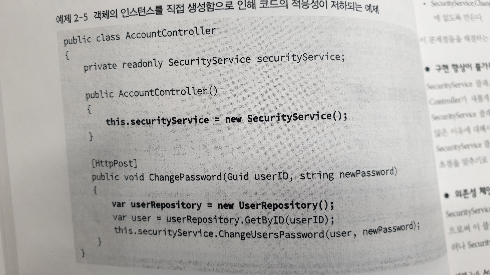
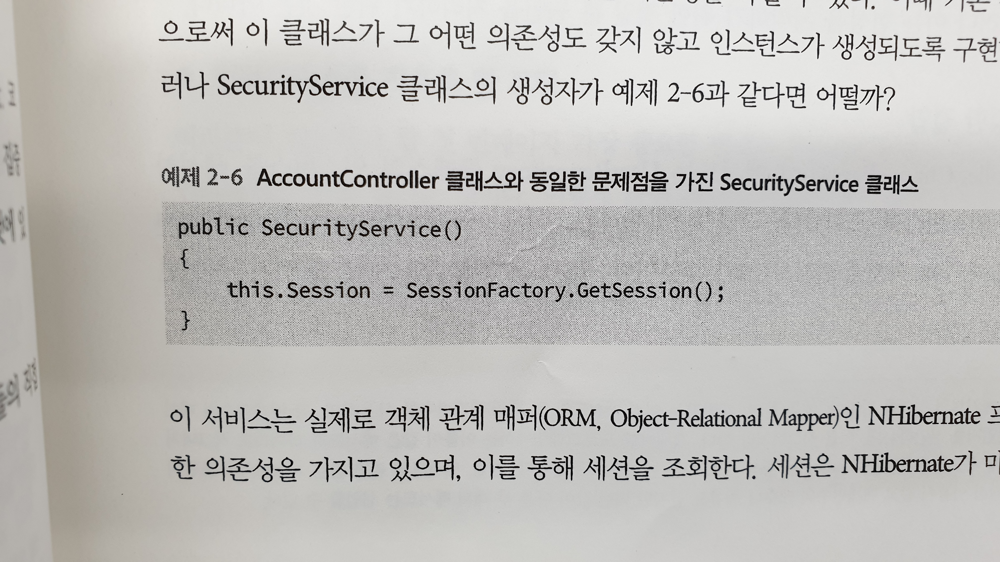
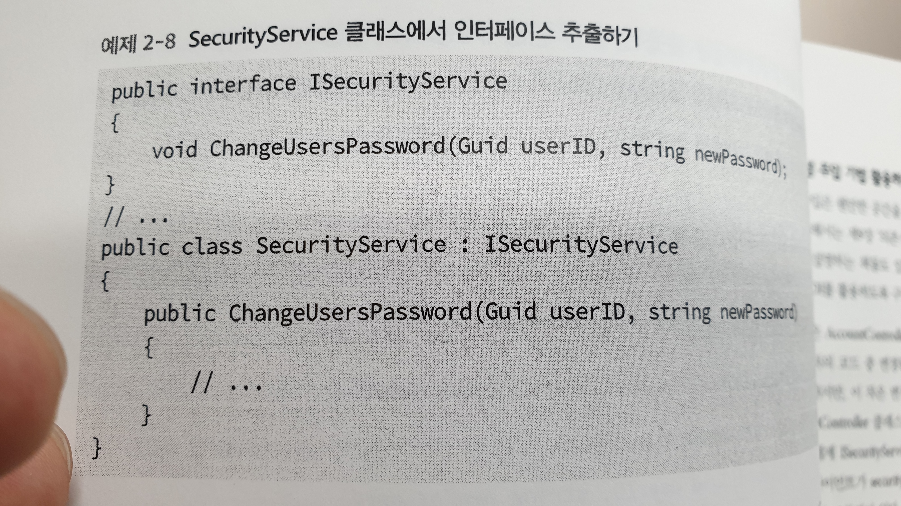
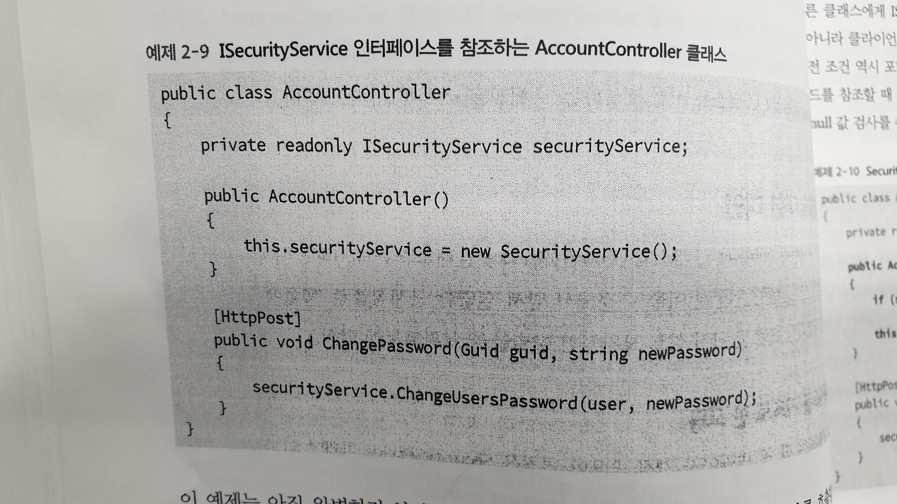
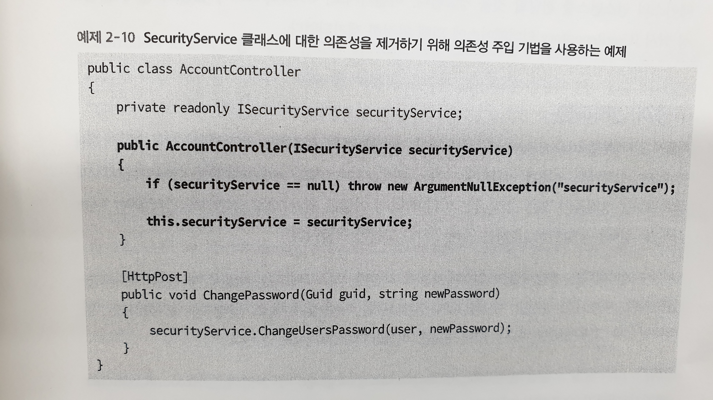
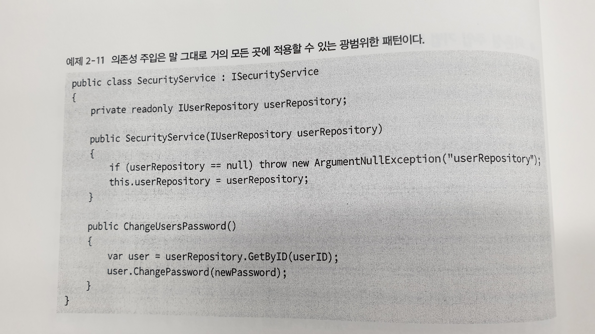

# 의존성 관리하기
- 의존성은 필요한 것이기는 하지만 추후 문제가 될 가능성이 있기 때문에 세심한 관리가 필요하다. 
- 의존성으로 인해 발생한 문제점은 되돌리기가 어려울 수도 있기 때문에, 지속적으로 관심을 두어 문제가 발생하지 않도록 한다.
- **패턴과 안티패턴** - 클래스와 인터페이스 사이에서 반복적으로 발생하게 되는 협업들의 규정하여 집대성한 것을 **패턴**이라 하며, 
  **안티패턴**은 실제로 많이 사용되는 패턴이지만 비효율적이거나 비생산적인 패턴을 의미한다. 
  (https://it-jin-developer.tistory.com/20)

## 구현과 인터페이스의 비교
- 컴파일 시 해당 클라이언트의 인터페이스가 어떤 구현체로 사용되고 있는지에 대해 전혀 알 필요가 없다. 
- 오히려 이에 대해 알게 된다면 인터페이스의 특정 구현체와 클라이언트 사이의 의존성이 더 높아지게 된다.

## new 키워드의 코드 스멜
- **코드 스멜은 프로그램의 가독성이 나쁘고, 중복된 로직을 포함하는 등 코드품질을 저하시키는 요인들을 총칭한다. (많다, 겹쳐있다, 이름이 어색하다, 객체지향적이지 않다)**
- 클래스의 경우 생성자를 수반하기 때문에 new 키워드의 사용(인스턴스의 직접적인 생성)은 부적절한 결합으로 ‘코드 스멜’로 취급한다.
- <예제 2-5> (코드 스멜의 예시)

1.  구현 향상이 불가능 - 수정 및 새로운 기능 추가가 어려움
2.  의존성 체인 <예제 2-6>

3.  테스트 가능성의 부재 - AccountController, SecurityService 클래스는 아무런 기능도 수행하지 않는 모의 객체로 교체할 수 없기 때문에 테스트 불가
4.  보다 부적절한 결합 - User 객체의 인스턴스를 얻지 못하면 메서드를 호출할 수 없음.

## 객체 생성에 대한 대안
- AccountController 클래스와 SecurityService 클래스의 부적절한 관계 개선 방법

### 인터페이스를 기초로 한 코딩 
- SecurityService 클래스의 실제 구현을 인터페이스 뒤로 숨긴다. (구현체가 아닌 인터페이스에만 의존하게 한다.)
- <예제 2-8> (SecurityService 클래스에서 인터페이스 추출)

- <예제 2-9> (ISecurityService  인터페이스를 참조하는 AccountController 클래스)

1.  SecurityService 클래스의 생성자를 호출함으로 여전히 의존성을 가지고 있음.

### 의존성 주입 기법 활용하기
- **의존성 주입(Dependency Injection, DI)은 프로그래밍 에서 구성요소간의 의존 관계가 소스코드 내부가 아닌 외부의 설정파일 등을 통해 정의되게 하는 디자인 패턴중의 하나이다. (위키백과)**
- 예제 2-10 (SecurityService에 대한 의존성 주입기법)

1. AccountController 클래스는 SecurityService 클래스의 인스턴스를 직접 생성하는 대신, 다른 클래스에게 ISecurityService 인터페이스를 제공해줄 것을 요구한다.
2. securityService 매개변수에 null 값 전달 방지 조건을 포함하여 항상 유효한 인스턴스를 참조하도록 한다.

1. SecurityService 클래스가 유효한 IUserRepository를 전달할 것을 강요한다. (의존성 제거)

    
